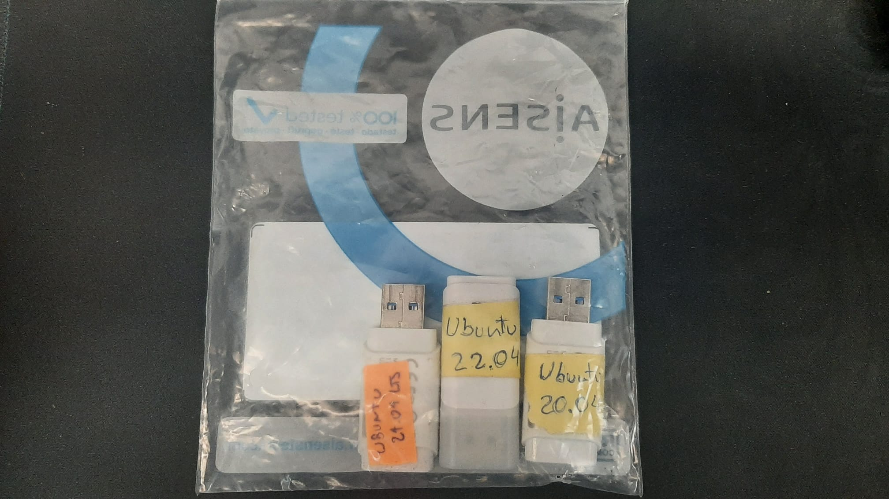

# Computer setup

This page contains the instructions for setting up a new computer for a member of the BBGLab team.

!!! INFO "User Action Required"
    Steps marked with 👤 require the new member to be present and perform the action themselves, as they involve personal credentials or settings that only the user should know.

## Ubuntu

### 1. Select Ubuntu version

In the _wardrobe > box with "DRIVES" label > plastic bag_, we have different USB sticks with different versions of Ubuntu.

As of today, we have:

-   Ubuntu 20.04
-   Ubuntu 22.04
-   Ubuntu 24.04



!!! TIP "Use the latest LTS version available"
    We recommend using the latest version available, which is currently Ubuntu 24.04. However, if you need to use a specific version for compatibility reasons, you can choose from the available options.

### 2. Install Ubuntu

#### Booting from USB

To install Ubuntu, follow these steps:

1. Insert the USB stick into the computer.
2. Restart the computer and enter the BIOS/UEFI settings (by pressing F2 or F10 repeatedly during boot).
3. Change the boot order to boot from the USB ("TOSHIBA") stick first. BIOS Setup > Boot > UEFI Boot Order.
4. Disable Secure Boot if it is enabled (this may be necessary for some versions of Ubuntu). BIOS Setup > Security > Secure Boot > Disabled.
5. Save the changes and exit the BIOS/UEFI settings.
6. Select "Try or Install Ubuntu" from the boot menu. This will open the Ubuntu live environment.

#### Installing and setting up Ubuntu

From the Ubuntu live environment, a pop-up will appear asking if you want to install Ubuntu. Click on "Install Ubuntu". If the pop-up does not appear, you can double-click the "Install Ubuntu" icon on the desktop.

Follow these steps:

1. Select your language: **English UK**
2. Select your keyboard layout: **Spanish (Catalan)**, unless the keyboard layout is different.
3. Connect the computer to the wired network and click **"Use wired connection"**. Using a wired connection is necessary for later steps.
4. Select **"Interactive installation"** and then **"Default installation"**.
5. ⚠️**IMPORTANT (see warning below)**⚠️: Select **"Erase disk and install Ubuntu"**. Then, click on **"Advanced features" > "Use LVM and encryption"**.
6. Set `bbglab` as the passphrase for the encryption. This will be used to unlock the disk during boot.
7. Fill in the following fields:
   - Your name: `Name Surname`
   - Your computer's name: `lopezXX`, where `XX` is the number of the computer (ask the Engineers team of the lab).
   - Pick a username: `nsurname`. **NOTE**: This should be the username of the cluster, which usually is the first letter of your name followed by your surname, but can differ slightly if the username already exists for common names. Check with the Engineers team to make sure which is the correct username.
   - Choose a password: `bbglab`. This password should then be changed by the user after the installation.
8. Click **"Continue"** to start the installation process. When finished, restart the computer and remove the USB stick when prompted.

!!! DANGER "DATA DELETION"
    Step 5 will **erase all data on the disk**, including any Windows installation or data from older users if the computer was previously used. Make sure to back up any important data before proceeding.

!!! NOTE
    These steps are written specifically for Ubuntu 24.04 installation. If you are using a different version, the steps may vary slightly, but the general process should be similar.

### 3. Install the necessary software

Before anything, make sure the software repositories are fetched and updated:

```sh
sudo apt update
sudo apt upgrade -y
```

Reboot.

#### Run the BGAdmin script

We have a custom bash script to automatically install necessary software and set up the BBGLab environment.
This can be found in the GitHub repository: <https://github.com/bbglab/bgadmin>.

1. Download or clone the bgadmin repository.
2. Run:
    ```sh
    sudo bash bgadmin-main/members/bbglab_ubuntu.sh
    ```
3. Follow the instructions for the installation.
4. Reboot to check everything works fine.

#### Extra software to install

-   Mamba
-   VSCode
-   Terminator

### 4. Set up irbcluster

Once the basic software is installed, you need to configure access to the IRB cluster. This requires the IRB username and password of the new member.

!!! NOTE
    You need to be connected to the IRB network (either physically in the office or through VPN) to access the cluster.

#### Generate SSH key

Create an SSH key for secure access to the cluster:

===+ "Ubuntu 22.04 and 24.04"

    ```sh
    ssh-keygen -t ecdsa
    ```

=== "Ubuntu 20.04"

    ```sh
    ssh-keygen
    ```

Follow the prompts and press Enter to use default settings.

This step is needed for two main reasons:

1. To let the user access the cluster without having to type the password every time.
2. To let bgmacgyver mount properly the cluster filesystem when activated.

#### Set up cluster alias

Add an alias for easier cluster access. Add this line to your `~/.bashrc` file:

```sh
echo "alias irbcluster='ssh -p 22022 irblogin02.irbbarcelona.pcb.ub.es'" >> ~/.bashrc
source ~/.bashrc
```

#### Configure WiFi and VPN 👤

First, configure the PCB WiFi and VPN in the network settings:

1. **PCB WiFi configuration:**
   - Security: WPA & WPA2 Enterprise
   - Authentication: LEAP
   - Username: Your IRB username
   - Password: Your IRB password

2. **VPN configuration:** Set up the VPN connection using your IRB credentials in the network configuration menu.

#### Copy SSH key to cluster 👤

Copy your SSH key to the cluster (you need to be connected to the IRB network or VPN):

```sh
ssh-copy-id -p 22022 irblogin02.irbbarcelona.pcb.ub.es
```

Enter your IRB password when prompted.

#### Test cluster connection 👤

Test that you can connect to the cluster:

```sh
irbcluster
```

You should be able to log in without entering a password.

#### Configure git 👤

Configure git with your IRB email and name:

```sh
git config --global user.email "yourusername@irbbarcelona.org"
git config --global user.name "Your Name"
```

Replace `yourusername` with your actual IRB username and `Your Name` with your full name.

#### Set up backup folder 👤

Connect to the cluster and create a backup folder for your laptop backups:

```sh
irbcluster
mkdir backup
exit
```

You can then configure the backup application on your laptop to use this folder for storing backups.

#### Change default password 👤

**IMPORTANT:** Change the default `bbglab` password that was set during installation:

```sh
passwd
```

Enter a secure password that only you know.

## Windows

To install Windows, we don't do it ourselves, but we ask the IT department to do it for us.
The only thing we need to do is ask them and send them the computer. 😃

## References

-   Carlos López-Elorduy
-   Miguel Grau
-   Federica Brando
