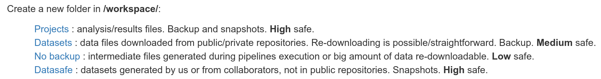
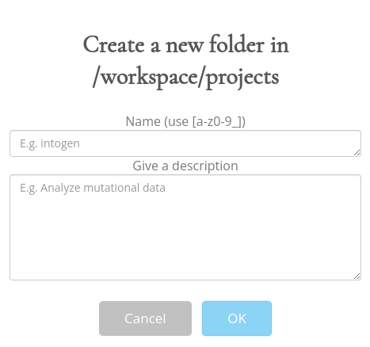

# New folder in workspace

## Description

Appart from your own personal folder, there are four main shared folders within the `/workspace` folder in the cluster. These are:

- **Projects**: analysis/results files. Backup and snapshots. **High** safe.
- **Datasets**: data files downloaded from public/private repositories. Re-downloading is possible/straightforward. Backup. **Medium** safe.
- **No backup**: intermediate files generated during pipelines execution or big amount of data re-downloadable. **Low** safe.
- **Datasafe**: datasets generated by us or from collaborators, not in public repositories. Snapshots. **High** safe.

If you want to create a new folder inside one of the previously mentioned, perform the following instructions:

1. Go to the [bbgdashboard](https://bbgcloud.irbbarcelona.org/dashboard/home)
2. Log in (or check that you are already logged in)
3. Go to the `Cluster` tab.

    

4. Click on one of the four options where you want to create your folder.

    

5. Write the title and a description of the new folder and click "OK".

    

## Possible errors

If after clicking the "OK" button an ERROR message is displayed:

- Make sure that you are **logged in** in the dashboard itself.
- Try doing everything from an **incognito window**.

## Reference

- Carlos López Elorduy
- Miguel Grau
- Jordi Deu-Pons
