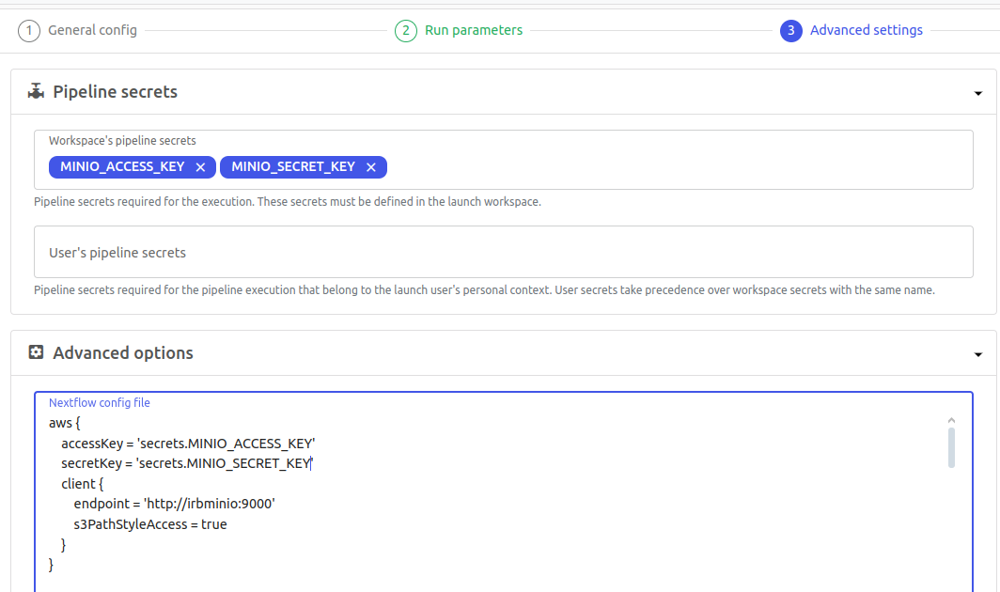

# S3 storage

## Table of Contents

- [What is a S3 Storage](#what-is-a-s3-storage)
- [How to access](#how-to-access)
    - [Terminal](#terminal)
- [How to use it](#how-to-use-it)
    - [Seqera and Nextflow](#seqera-and-nextflow)
    - [Python](#python)

## What is a S3 Storage?

S3 (Simple Storage Service) is an *object storage service*.
It stores data as objects inside buckets, rather than as files in directories. Each object consists of:

- Data (the file itself),
- Metadata (descriptive tags), and
- A unique key (the object's identifier within a bucket).

Unlike traditional file systems like our
[standard partitions](https://bbglab.github.io/bbgwiki/Cluster_basics/Structure) (NetApp), S3 is not a native POSIX
filesystem. It's not designed for direct file editing or low-latency access. While it can be mounted using tools
like `rclone mount` or `s3fs`, this is more of a workaround. It may not behave exactly like a regular shared folder.
Instead, most modern tools and workflows such as Nextflow, Snakemake, and Python libraries are increasingly adapted
to interact with S3 natively. This offers better performance and scalability for data-intensive pipelines.

S3 offers several advantages: it's scalable, ideal for storing large volumes of data (including hundreds of GB or
more). It also supports fine-grained access control, and integrates well with cloud-native or container-based
pipelines. In our case, S3 is used as static storage for raw data and final results, not as a working directory
where files are constantly modified.

We use [Minio](https://min.io/docs/minio/linux/index.html), a local S3-compatible server (instead of AWS S3) to
manage this storage on-premises.

## How to access

!!! note
    S3 only available from the new [IRB cluster](https://bbglab.github.io/bbgwiki/Cluster_basics/IRB_cluster)

~~By default, MinIO web access to S3 is available to all BBG members. It allows browsing buckets and downloading small
files (e.g., metadata, images).~~

MinIO web access to S3 is now only available to users on paid plans. It is no longer accessible to IRB members.

From now on, access to S3 is only possible via the terminal (e.g., to navigate, run Python scripts, or execute Nextflow
 pipelines outside Seqera). To use terminal access, you need to generate S3 credentials.

If you only want to use S3 files in your Nextflow pipelines through [seqera platform](https://cloud.seqera.io/), no
further setup is needed. Credentials are already configured in the pipelines; you only need to export them.

### Terminal

To use it via terminal, once in the IRB cluster:

```bash
# Load conda environment
$ ml load anaconda3/2023.09-0-yjzjr4h
$ module load anaconda3
$ conda activate s3-minio

# Generate credentials
# -r -> creates the ~/.config/rclone/rclone.conf file
# -d -> duration in days for credentials validity
$ python3 /apps/scripts/irb-storage-public-scripts/minio/minio-sts-credentials-request.py -u mgrau -r -d 365

# test
$ rclone lsf irb-minio://bbg
```

This script (*minio-sts-credentials-request.py*) generates the config file used by rclone:

```bash
$ cat ~/.config/rclone/rclone.conf

[irb-minio]
type = s3
provider = Minio
endpoint = http://irbminio.irbbarcelona.pcb.ub.es:9000
acl = bucket-owner-full-control
env_auth = false
access_key_id = ***
secret_access_key = ***
session_token = ***
```

If you want to use another S3 client, you need to create the credentials file. For example, for aws-cli (replace with
 your keys/token from the *rclone.config*):

```bash
$ cat ~/.aws/credentials

[default]
aws_access_key_id= **
aws_secret_access_key= **
aws_session_token= **
endpoint_url = http://irbminio.irbbarcelona.pcb.ub.es:9000
```

As mentioned earlier, you can mount an S3 bucket as a POSIX-like partition (similar to what McGyver does):

!!! warning
    This allows you to browse S3 buckets as if they were part of the local file system, although it's typically
    read-only and it is **not recommended** for high-performance or heavy I/O use cases.

```bash
$ ls /home/mgrau/s3/bbg-scratch/
# Mount
$ rclone mount irb-minio:bbg-scratch /home/mgrau/s3/bbg-scratch --vfs-cache-mode off --read-only &
[1] 636085
$ ls /home/mgrau/s3/bbg-scratch/
work
# Unmount
$ fusermount -u /home/mgrau/s3/bbg-scratch
[1]+  Done                    rclone mount irb-minio:bbg-scratch /home/mgrau/s3/bbg-scratch --vfs-cache-mode off --read-only
$ ls /home/mgrau/s3/bbg-scratch/
$
```

Once your aws credentials are generated, you can use [stu](https://github.com/lusingander/stu) as a TUI explorer. You don't need to mount the S3 bucket:

```bash
spack load stu
stu
```


## How to use it

### Seqera and Nextflow

As mentioned, you don’t need to include any credentials explicitly in Seqera to run a job. When accessing S3 data
from a pipeline, remember to select the secrets and include the info in the config:



If using nextflow in a terminal, you can add the credentials to the *nextflow.config*

### Python

To access an S3 file from a Python script, there are different libraries: boto3, s3fs and dask.
All three will automatically use the credentials in `~/.aws/credentials` if it exists.

!!! note
    AI recommends... Dask! Compared to s3fs and boto3, is much faster and optimized for parallel and distributed
    computing, enabling efficient processing of files hundreds of gigabytes in size. While boto3 is a low-level
    client and s3fs provides filesystem-like access, Dask builds on them to offer high-level, scalable data workflows
    that can handle massive datasets seamlessly.

#### boto3

```python
import boto3
import pandas as pd
import botocore


# Initialize the S3 client
s3 = boto3.client('s3')

# Define your bucket and file key
bucket_name = 'bbg'
file_key = 'data/example/file.vcf'

# Read the file object directly, without downloading
response = s3.get_object(Bucket=bucket_name, Key=file_key)
content = response['Body'].read().decode('utf-8')

# Extract the data starting from the VCF header (#CHROM ...)
lines = content.strip().split('\n')
vcf_data = [line for line in lines if not line.startswith('##')]  # Skip metadata

# Load the VCF data into a DataFrame
df = pd.read_csv(StringIO('\n'.join(vcf_data)), sep='\t', comment='#')

# Display the first few rows
print(df.head())
```

#### s3fs

```python
import s3fs
import pandas as pd

# Initialize the S3 file system
fs = s3fs.S3FileSystem(client_kwargs={'endpoint_url': 'http://irbminio:9000'})

# Read the VCF file with proper handling
with fs.open("bbg/data/example/file.vcf", 'r') as f:
    # Extract the data starting from the VCF header (#CHROM ...)
    vcf_data = [line for line in f if not line.startswith('##')]

# Convert the data to a DataFrame
from io import StringIO
df = pd.read_csv(StringIO(''.join(vcf_data)), sep='\t', comment='#')

# Display the DataFrame
print(df.head())
```

#### dask

```python
import dask.dataframe as dd
import s3fs

# Read the file using Dask (with appropriate filters)
df = dd.read_csv("s3://bbg/data/example/file.vcf",
                 sep='\t', 
                 comment='#',  # Ignore metadata lines starting with `##`
                 blocksize='16MB',  # Adjust block size as needed
                 dtype='str')  # Ensures flexible data type handling

# Display the first few rows
print(df.head())
```
