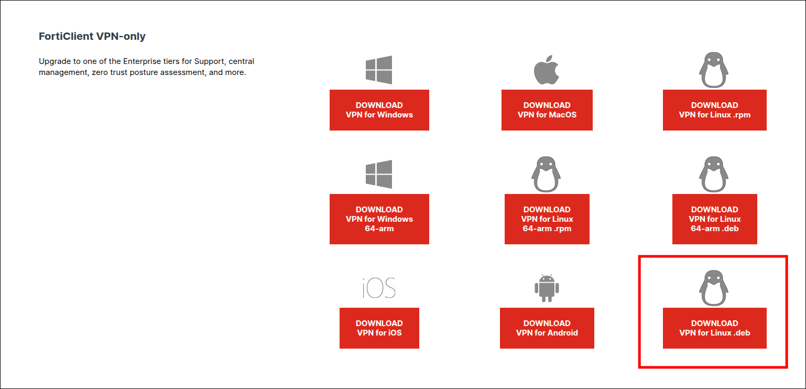

# VPN

When working from home or outside the PCB, connecting to the VPN is needed in order to have access to resources such
as the cluster.

## First Things First - Install the FortiClient

1. Go to
   [https://www.fortinet.com/support/product-downloads#vpn](https://www.fortinet.com/support/product-downloads#vpn)
2. Download the FortiClient VPN
   

3. Install the FortiClient VPN on your system.
    - On Ubuntu/Debian, run:

        ```sh
        sudo apt-get install ./<your-downloaded-forticlient-file>.deb
        ```

    - On other operating systems, double-click the downloaded installer and follow the on-screen instructions.

4. Once FortiClient is installed, if you are on Ubuntu, run:

    !!! warning "DNS Configuration Warning"
        The following commands require administrator privileges and permanently change your system-wide DNS
        configuration. This will force DNS queries to use the server `10.10.16.4` and the domain
        `sc.irbbarcelona.org` even when you are not connected to the VPN. To revert this change later, remove the
        file and restart systemd-resolved:
        `sudo rm /etc/systemd/resolved.conf.d/vpn.conf && sudo systemctl restart systemd-resolved`

    ```sh
    sudo su
    ```
    ```sh
    mkdir -p /etc/systemd/resolved.conf.d && echo -e "[Resolve]\nDNS=10.10.16.4\nDomains=~sc.irbbarcelona.org" >  /etc/systemd/resolved.conf.d/vpn.conf && systemctl restart systemd-resolved
    ```

5. Download
   [this configuration file](https://drive.google.com/file/d/11XyRfBM4eGn08a3qsiKY1PLBa7DIBTuS/view?usp=drive_link)
   to your computer. Keep this configuration file; you will import it into FortiClient in the following steps.
6. In the FortiClient VPN main window, click the three-bar menu icon (usually in the top-right corner) and select
   "Add a new connection".
7. In the "Add a new connection" window, click the "XML" tab, then click the "+ Import XML Configuration" button,
   and finally click "Save".
   !!! note "Important"
       **Don't enter your password here**. This will be done in the next steps.

8. Now, back in the initial FortiClient VPN window, you should see "VPN-nexica". Click the three-bar menu icon again
   and select "Edit the selected connection".
9. Here, you can optionally click on the option "Save login", and then enter your cluster username and then your
   password. Click "Save".

    !!! warning "Security Notice"
        Only use **Save login** on your own trusted, non-shared computer. On shared or public machines, or in
        high-security environments, leave **Save login** disabled and enter your password manually each time.

10. Now you are ready. Click connect!

## Connecting from the terminal

| Description         | Command                                 |
| ------------------- | --------------------------------------- |
| Connect to VPN      | `forticlient vpn connect VPN-nexica`    |
| Disconnect from VPN | `forticlient vpn disconnect VPN-nexica` |
| Check VPN status    | `forticlient vpn status`                |

## References

- Carlos López-Elorduy
