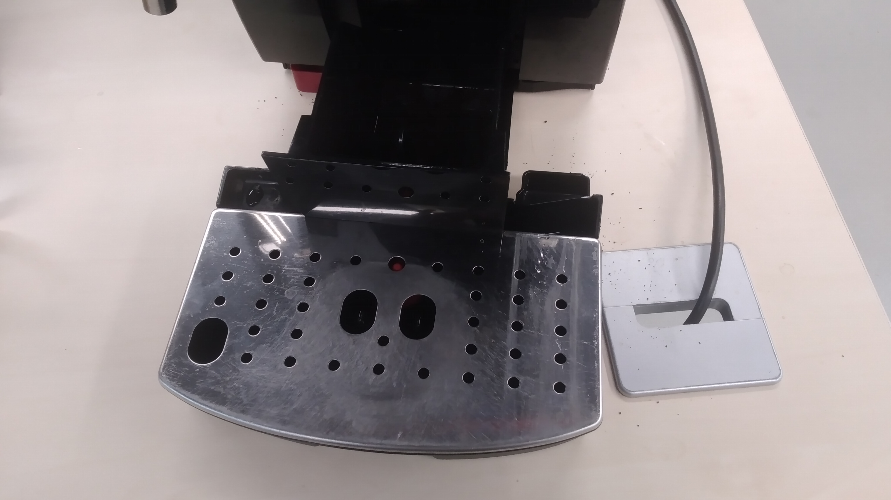
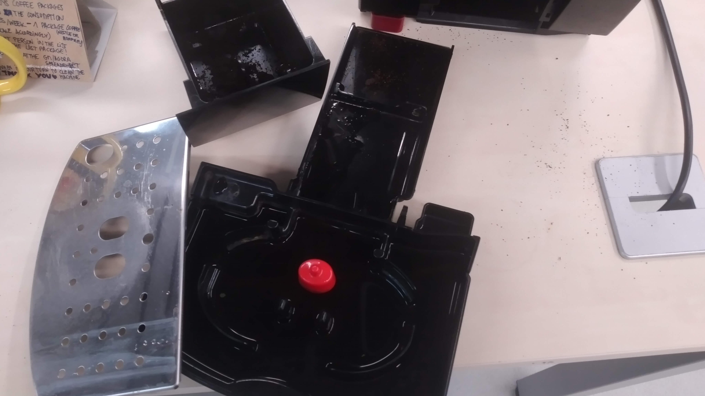
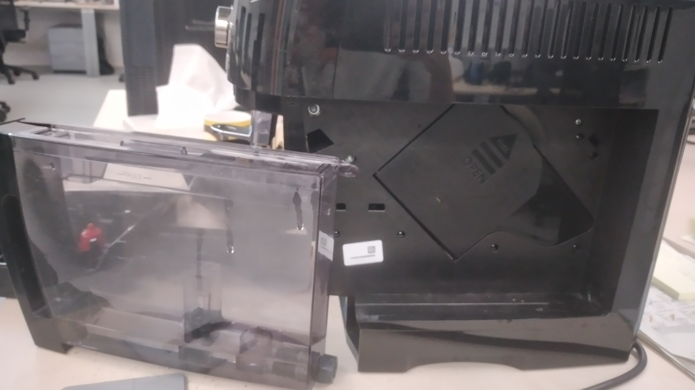
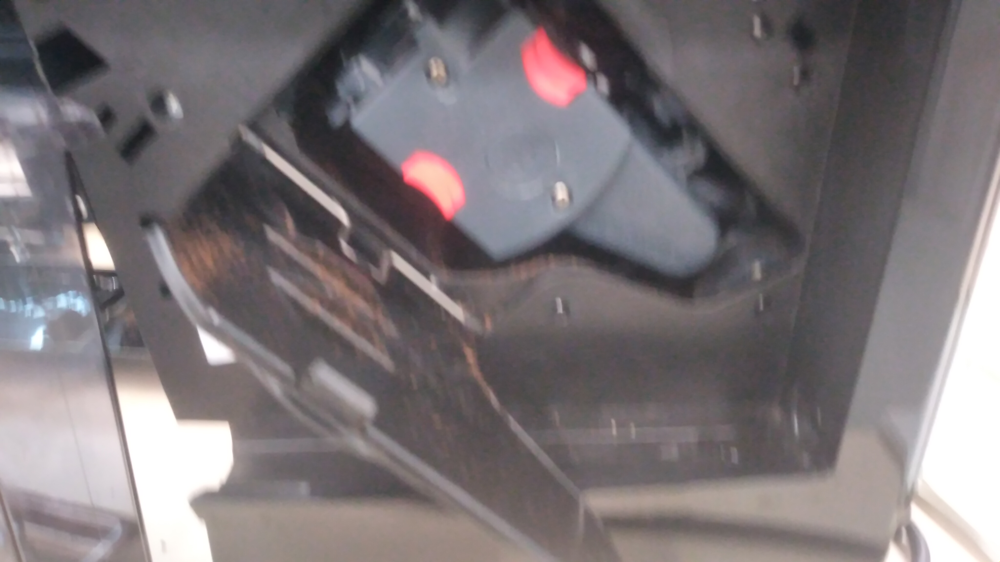
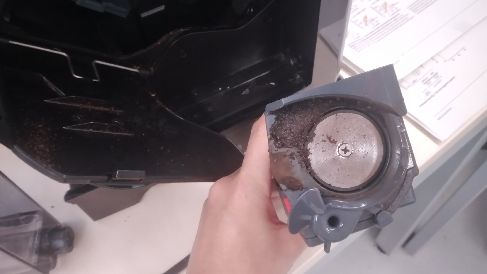

# Info for bbg-coffee drinkers
## System for the coffee:
- Every week there is one person responisble for cleaning the coffe machine.
- There list is [here](https://docs.google.com/spreadsheets/d/1fA5wBTpkHbuZXG3J1i39s_XP5k__pzl_qwYGCRwjgvI/edit#gid=1753640121) in the same group meetings & agora sheet, on the right side).
- The same list works for cleaning the coffee machine (weekly, our names are on it) and buying coffee (every time we buy we write our name).
- Anytime there is one package left of coffee, we tell the next person in the list, and once this person buys coffee we will write the name on the same week this person bought the coffee. Once there is the last package of coffee open, we tell the next person, and so on.
- Each one of us will buy the coffee according to our coffee consumption. The ratio is:

>5 coffees per week - buy 1 kg of coffee (and scale accordingly) 

### Important notes
- The 5 coffees are average... just try to make an approximation, doesn't need to be super exact. You can use the amount of coffees you've been taking last month, for instance, and make the mean per week.
- It is **everyone's responsibility to know if we are using the last coffee package**. I recommend telling the next person in the list whenever we are opening the last package.- - - Not everyone has permissions to edit the spreadsheet. Just tell Monica, Erika or Martina.
- We can try to buy the same brand: now we are using the [Nestle Bonka](https://www.amazon.es/Bonka-428221-Caf%C3%A9-grano-Natural/dp/B00XA1QNAM/ref=asc_df_B00XA1QNAM/?tag=googshopes-21&linkCode=df0&hvadid=366311326534&hvpos=&hvnetw=g&hvrand=6258043893641885346&hvpone=&hvptwo=&hvqmt=&hvdev=c&hvdvcmdl=&hvlocint=&hvlocphy=1005424&hvtargid=pla-790606492934&th=1). Also at some point Erika was buying from [Bon preu](https://www.compraonline.bonpreuesclat.cat/products/83654/details) and it was also good. With this system we would buy like once a year, enough time to find where to buy these brands 
- If you drink coffee very rarely, I think you don't need to enter the system, we can invite you 

Feel free to add or remove yourself from the list whenever you change your coffee consumption routine (see that the list is repeated twice). Just tell Monica and she will modify the list in the spreadsheet.

## How to clean the coffee machine
1. Turn off the coffee machine and unsamble all the parts shown in the pictures below, in that order:
   
  **1** 
  **2** 
  **3** \
  **4** 
  **5**  \
  To extract this inner part (coffee grinder),  press the red buttons and pull out.  
   
3. Wash with soap all the parts **EXCEPT** the grinder. You can use the sink in the EBL, ask any member of the wet lab). The grinder is cleaned just by running water (**NO SOAP**).
4. Rinse all pieces and dry it with paper.
5. Put back all the pieces, in the inverted order in which you took them off.

Remember to tidy up a little bit, for any remaining coffee leftovers on the table.

Thanks a lot!

## References

- Monica
- Martina
- Erika
