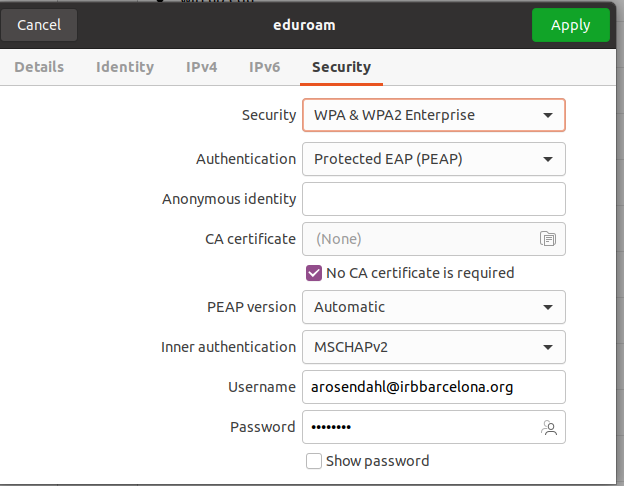

# Eduroam

## Configuration

- **Security:** WPA & WPA2 Enterprise
- **Authentication:** Protected EAP (PEAP)
- **Anonymous identity:** _Empty_
- Check the checkbox "_No CA certificate is required_"
- **PEAP version:** Automatic
- **Inner authentication:** MSCHAPv2
- **Username:** clusteruser@irbbarcelona.org
- **Password:** _IRB password_

## Example

## Reference

- Martina Gasull
- Carlos López-Elorduy
- Miguel Grau
