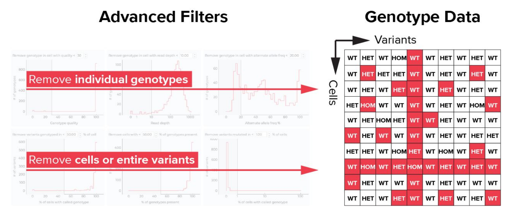

# Mosaic - python package

This package provides a set of tools to analyze data produced by Tapestri instruments (`.h5` files). It is NOT open
source, although data can be exctrated and analysis can be held either using mosaic functions or custom functions.

!!! info "package version"
    This wiki is based on Mosaic v2.2, the package is mantained and constantly updated by missionbio, therefore some
    things maybe be changed. If you are using a new version of the package please refer to the
    [official documentation](https://missionbio.github.io/mosaic/index.html).

## Installation

The package is available in [conda](https://anaconda.org/missionbio).

```sh
conda create --name mosaic -c missionbio -c plotly -c conda-forge missionbio.mosaic notebook
conda activate mosaic
```

??? tip "Tip - Installing from exported environment"
    Another way of installing mosaic with some other packages used during the first analysis of the data is with the
    exported env: `/data/bbg/projects/scell_tall/mosaic180123.txt`.

    ```sh
    conda create --name mosaic --file /data/bbg/projects/scell_tall/mosaic180123.txt
    ```

## Jupyter tutorials

!!! quote "How do I access a jupyter notebook? "
    please, if you are having hard time accessing a Jupyter notebook, refer to this
    [guide](../../../Cluster_basics/Notebooks_in_cluster.md).

!!! warning "Data accessibility"
    You might need additional accessibility to run some of the analysis available in the jupyter notebooks.

In the folder `/data/bbg/projects/scell_tall/LOPEBIG_44_analysis/` there are four notebooks that were used to do some
of the initial analysis on data. In these notebooks you can find some of mosaic built-in
functions and some custom functions.

Additionally you can find some other notebooks in the section below: [Link](Mosaic.md#links) and in the
folder `/data/bbg/projects/scell_tall/LOPEBIG_44_analysis/`

## FAQ

Since there is no section with FAQ on mosaic documentation, here we collect our questions and the answers missionbio
support provided. If you intend to ask more questions to their [support](mailto:ivan.lukic@missionbio.com),
please update this section.

??? question "How `min_prc_cells` and `min_mut_prct_cells` are computed?"
    In mosaic they are calculated on the total numbers of cells in the dataset. Differently from Tapestri
    Insights where they are computed on the percentage of genotyped.

??? question "Why do I get different number of variants when uploading samples in Tapestri Insight and when
loading a merged `.h5` file in Mosaic?"
    _Still waiting for a response_

??? question "How is the data filtered by the `ms.load("path/to/.h5", raw=False, apply_filter=True)` function?"
    - The `raw` parameter set to False discards empty barcodes
    - The `apply_filter` parameter set to True loads only the variants that meets the
[Tapestri Insights advanced filters](https://support.missionbio.com/hc/en-us/articles/360042326414-Advanced-filtering).

    We have a final matrix that excludes all those cells or variants that do not meet the filters and a
    **filter layer** called `FILTER_MASK` filled with 1 and 0 that excludes the genotypes (single cell in the matrix)
    that do not meet the filters. 

    [](https://support.missionbio.com/hc/en-us/article_attachments/360074948754/Tapestri_Insights___Advanced_Filtering_Explained.pdf)
    

## Additional resources

MissionBio provides some video tutorials on their website: [Mosaic tutorials](https://missionbio.github.io/mosaic/1_introduction.html#additional-resources)<!-- markdownlint-disable MD013 -->

Additionally, the company provided a personal training course, the video lessons can be found here:

```sh
/data/bbg/projects/scell_tall/LOPEBIG_44_analysis/mosaic/Video_Trainings/MissionBio-3_1-Mosaic.mp4

/data/bbg/projects/scell_tall/LOPEBIG_44_analysis/mosaic/Video_Trainings/MissionBio-3_2-Mosaic.mp4
```

## Links

- [Mosaic documentation](https://missionbio.github.io/mosaic/index.html)
- [Mosaic GitHub repo](https://github.com/MissionBio/mosaic)
- [Mosaic Jupyter tutorial notebook](https://missionbio.github.io/mosaic/_sources/examples/analysis-walkthrough.ipynb)

## Reference

- Federica Brando
- Raquel Blanco
