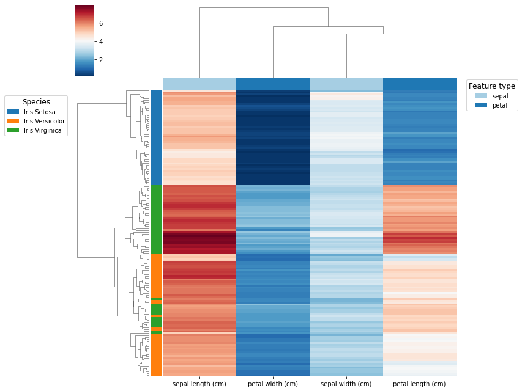

# Clustermap plot

Example of how to generate clustermaps with multiple annotation rows or columns using seaborn.

## Import packages and load toy data

``` py
import pandas as pd
import seaborn as sns
import matplotlib.pyplot as plt
from matplotlib.patches import Patch
from sklearn.datasets import load_iris

# Load the dataset
iris = load_iris()
df = pd.DataFrame(data=iris.data, columns=iris.feature_names)

# Add some categorical features
df["species"] = iris.target
target_map = {0 : "Iris Setosa",
              1 : "Iris Versicolor",
              2 : "Iris Virginica"}
df["species"] = df.species.map(target_map)
df["genus"] = "Iris"
df["family"] = "Iridaceae"
```

## Simple clustermap

``` py
sns.clustermap(df.drop(columns=["species", "genus", "family"]),
               yticklabels=False,
               xticklabels=True,
               cmap = "RdBu_r")
plt.show()
```


## Clustermap with individual annotations

``` py
## Annotations

# Annotation row
annotation_row = df.pop("species")
lut_row, row_colors = get_annotation_colors(annotation_row, "tab10")

# Annotation col
annotation_col = pd.Series([col.split(" ")[0] for col in df.columns], name="Feature")
lut_col, col_colors = get_annotation_colors(annotation_col, "Paired")

## Clustermap

g = sns.clustermap(df,
                   yticklabels=False,
                   xticklabels=True,
                   cmap = "RdBu_r",
                   row_colors = [row_colors],
                   col_colors = [col_colors])

## Legends

# Annotation col
handles = [Patch(facecolor=lut_col[name]) for name in lut_col]
g.ax_col_dendrogram.legend(handles, lut_col, 
                           title="Feature type", 
                           ncol=1,
                           title_fontsize=12, fontsize=10,
                           bbox_to_anchor=(1.13, .8), 
                           bbox_transform=plt.gcf().transFigure)

# Annotation row
handles = [Patch(facecolor=lut_row[name]) for name in lut_row]
g.ax_row_dendrogram.legend(handles, lut_row, 
                           title="Species", 
                           ncol=1,
                           title_fontsize=12, fontsize=10,
                           bbox_to_anchor=(.01, .76), 
                           bbox_transform=plt.gcf().transFigure)

plt.show()
```


