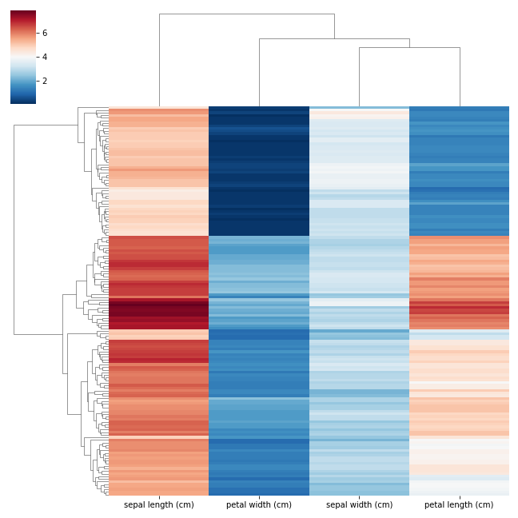

# Clustermap plot

Example of how to generate clustermaps with multiple annotations (rows or columns) using seaborn.  

Clustermaps are pretty easy to generate, however if we are interested in adding more than two annotations (column/s and/or row/s) the process might not be so trivial. If this is your objective, here you could find a couple of useful tips. Please check [seaborn]([https://duckduckgo.com](https://seaborn.pydata.org)) documentation if you didn't do so.

## Import packages and load toy data

``` py
import pandas as pd
import seaborn as sns
import matplotlib.pyplot as plt
from matplotlib.patches import Patch
from sklearn.datasets import load_iris

# Load the dataset
iris = load_iris()
df = pd.DataFrame(data=iris.data, columns=iris.feature_names)

# Add some categorical features
df["species"] = iris.target
target_map = {0 : "Iris Setosa",
              1 : "Iris Versicolor",
              2 : "Iris Virginica"}
df["species"] = df.species.map(target_map)
df["genus"] = "Iris"
df["family"] = "Iridaceae"
```

## Simple clustermap

``` py
sns.clustermap(df.drop(columns=["species", "genus", "family"]),
               yticklabels=False,
               xticklabels=True,
               cmap = "RdBu_r")
plt.show()
```




## Clustermap with individual annotations

We can add the first two annotation legends using customized handles (custom artist objects that can be added to a legend in a Seaborn plot), `g.ax_col_dendrogram` and `g.ax_row_dendrogram`.

``` py
def get_annotation_colors(series, cmap):
    
    lut = dict(zip(series.unique(), sns.color_palette(cmap)))
    colors = series.map(lut)
    
    return lut, colors
``` 

``` py
## Annotations

# Annotation row
annotation_row = df.pop("species")
lut_row, row_colors = get_annotation_colors(annotation_row, "tab10")

# Annotation col
annotation_col = pd.Series([col.split(" ")[0] for col in df.columns], name="Feature")
lut_col, col_colors = get_annotation_colors(annotation_col, "Paired")

## Clustermap

g = sns.clustermap(df,
                   yticklabels=False,
                   xticklabels=True,
                   cmap = "RdBu_r",
                   row_colors = [row_colors],
                   col_colors = [col_colors])

## Legends

# Annotation col
handles = [Patch(facecolor=lut_col[name]) for name in lut_col]
g.ax_col_dendrogram.legend(handles, lut_col, 
                           title="Feature type", 
                           ncol=1,
                           title_fontsize=12, fontsize=10,
                           bbox_to_anchor=(1.13, .8), 
                           bbox_transform=plt.gcf().transFigure)

# Annotation row
handles = [Patch(facecolor=lut_row[name]) for name in lut_row]
g.ax_row_dendrogram.legend(handles, lut_row, 
                           title="Species", 
                           ncol=1,
                           title_fontsize=12, fontsize=10,
                           bbox_to_anchor=(.01, .76), 
                           bbox_transform=plt.gcf().transFigure)

plt.show()
```


## Clustermap with multiple annotations

The function below can be very handy if we are interested in adding 3 or more annotations.

``` py
def add_extra_legends(g, series, lut, title, bbox_to_anchor=(.01, 0.5)):
    
    xx = []
    for label in list(series.unique()):
        x = g.ax_row_dendrogram.bar(0, 0, color=lut[label], label=label, linewidth=0)
        xx.append(x)
    legend = plt.legend(xx, 
                        series.unique(), 
                        title = title, 
                        bbox_to_anchor = bbox_to_anchor, 
                        bbox_transform = plt.gcf().transFigure)
    plt.gca().add_artist(legend)
```

``` py
## Annotations

# Annotation row_1
annotation_row1 = df.pop("species")
lut_row1, row_colors1 = get_annotation_colors(annotation_row1, "tab10")

# Annotation row_2
annotation_row2 = df.pop("genus")
lut_row2, row_colors2 = get_annotation_colors(annotation_row2, "pastel")

# Annotation row_3
annotation_row3 = df.pop("family")
lut_row3, row_colors3 = get_annotation_colors(annotation_row3, "Set2")

# Annotation row df
row_colors = pd.DataFrame({"Species" : row_colors1,
                           "Genus" : row_colors2,
                           "Family" : row_colors3}) 

# Annotation col
annotation_col = pd.Series([col.split(" ")[0] for col in df.columns])
lut_col, col_colors = get_annotation_colors(annotation_col, "Paired")


## Clustermap
g = sns.clustermap(df,
                   yticklabels=False,
                   xticklabels=True,
                   cmap = "RdBu_r",
                   row_colors = row_colors,
                   col_colors = [col_colors])

## Legends

# Annotation col
handles = [Patch(facecolor=lut_col[name]) for name in lut_col]
g.ax_col_dendrogram.legend(handles, lut_col, 
                           title="Feature type", 
                           bbox_to_anchor=(1.13, .8), 
                           bbox_transform=plt.gcf().transFigure)

# Annotation row 1
handles = [Patch(facecolor=lut_row1[name]) for name in lut_row1]
g.ax_row_dendrogram.legend(handles, lut_row1, 
                            title="Species", 
                            bbox_to_anchor=(.01, .76), 
                            bbox_transform=plt.gcf().transFigure)

# Annotation row 2
add_extra_legends(g, annotation_row2, lut_row2, "Genus", bbox_to_anchor=(.01, .65))

# Annotation row 3
add_extra_legends(g, annotation_row3, lut_row3, "Family", bbox_to_anchor=(.01, .58))

plt.show()
```


