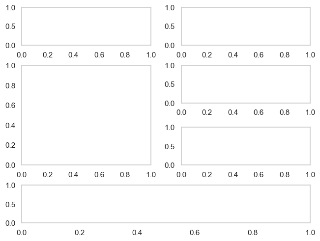

# GridSpec for dummies
When we want to create a figure that includes more than one plot, while having the possibility to manage each of these individually, we can normally achieve this by using the `pyplot.subplots` command. However, there are complex cases that `pyplot.subplots` cannot handle. In these cases, we should use the `GridSpec` function, also from `matplotlib`.  

It can be difficult to generate the desired grid and trying to allocate each of the plot to its correct coordinates, specially, when the plot spans multiple rows or columns. I recommend to first draw a draft of the desired plot layout. And then divide the figure in rows (red lines) and columns (blue lines) as the example. Like this, you know the particular coordinates for a plot. Then, the coding is really easy. 

    #Import necessary libraries
	import matplotlib.pyplot as plt
    from matplotlib.gridspec import GridSpec
	
	#Initialise figure
	fig = plt.figure(layout = "constrained")
 
	#Initialise Gridspec (number of rows, number of columns, figure)
	gs = GridSpec (4, 2, figure = fig)
 
	#Add grids to add the plots later
	#Plot A spans row 0 and column 0
	ax_a = fig.add_subplot(gs[0, 0]) 
	ax_b = fig.add_subplot(gs[0, 1])
	#Plot C spans rows 1 and 2; and column 0
	ax_c = fig.add_subplot(gs[1:3, 0]) #Remember the slicing rules in Python
	ax_d = fig.add_subplot(gs[1, 1])
	ax_e = fig.add_subplot(gs[2, 1])
	#Plot D spans row 3 and all the columns
	ax_f = fig.add_subplot(gs[3, 0:])

Author: Olivia Dove Estrella
