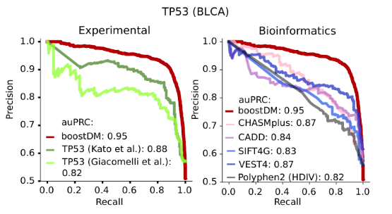
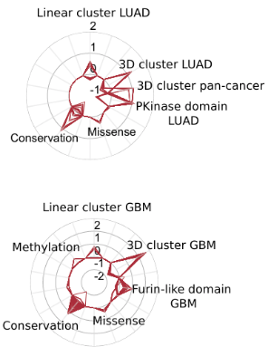
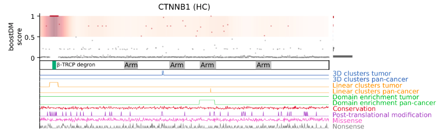

# IntOGen - boostDM plots

Examples of how to generate different types of plots found in the IntOGen + boostDM suite.

## IntOGen
*(Pending)*
<!--- Include a examples from intogen --->

## boostDM
All the code for figures of the boostDM paper are included in the following public repo: [boostDM paper analyses repo](https://github.com/bbglab/boostdm-analyses). 
Find below references to the publicly available repo as well as to example scripts stored in the bbg-cluster ``/workspace``.

### Precision-Recall Curves

#### Public repo
[Figure 1 code](https://github.com/bbglab/boostdm-analyses/tree/master/Figure1), [Manuscript Figure 1 PDF](https://github.com/bbglab/boostdm-analyses/blob/master/figures_paper/Figure1.pdf)

#### BBG Workspace
Notebook: ``/workspace/projects/boostdm_ch/notebooks/benchmarks-precision-recall.ipynb``

### Radar plots

#### Public repo
[Figure 2 code](https://github.com/bbglab/boostdm-analyses/tree/master/Figure2), [Manuscript Figure 2 PDF](https://github.com/bbglab/boostdm-analyses/blob/master/figures_paper/Figure2.pdf)

#### BBG Workspace
Notebook: ``/workspace/projects/boostdm_ch/notebooks/run8_20220705_feature-landscape/BoostDM-CH_run20220705_blueprints_SDM_JER.ipynb``

### Blueprints

#### Public repo
[Figure 3 code](https://github.com/bbglab/boostdm-analyses/tree/master/Figure3), [Manuscript Figure 3 PDF](https://github.com/bbglab/boostdm-analyses/blob/master/figures_paper/Figure3.pdf)

#### BBG Workspace
Notebook: ``/workspace/projects/boostdm_ch/notebooks/run8_20220705_feature-landscape/BoostDM-CH_run20220705_blueprints_SDM_JER.ipynb``

# Reference
* Ferran Muiños
* Santi Demajo
* Joan Enric Ramis
