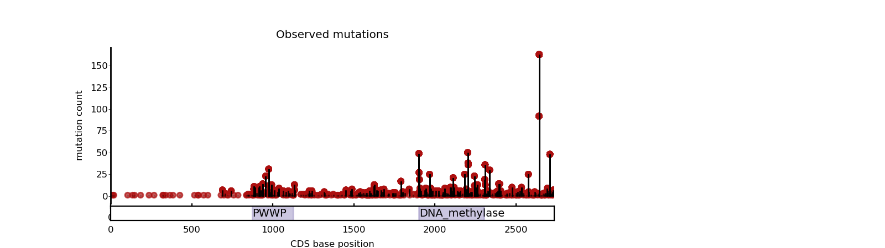

# Needle plot

## Description
A **needle plot** displays vertical lines that connect the data points to a horizontal baseline. 
Needle plots are useful when you want to plot frequency of mutations on the protein body.

The `needle_plot` function allows you to perform the needle plot with the representation of the protein body including domains.
It requires an **input matrix**  including gene name column called `'gene'`, nucleotide position column called `'Protein_position'` and the number of mutations affecting the same position `'number_observed_muts'`. 
The function also needs the **gene** name and the **transcript** used. 

## Function
```py
def needle_plot(data, gene, transcript):
    
    mpl.rcParams.update(mpl.rcParamsDefault)
    plt.rcParams['font.sans-serif'] = ['arial']
    plt.rcParams['font.size'] = 6
    plt.rcParams['font.family'] = ['sans-serif']
    plt.rcParams['svg.fonttype'] = 'none'
    plt.rcParams['mathtext.fontset'] = 'custom'
    plt.rcParams['mathtext.cal'] = 'arial'
    plt.rcParams['mathtext.rm'] = 'arial'
    mpl.rcParams['figure.dpi']= 200

    # get PFAM domains and subset the mutation data
    subset_data_pfam = get_PFAMs_per_transcript(PFAM_files, PFAM_info, transcript)

    # define figure layout
    fig = plt.figure(figsize=(8, 2.25))
    # ! SDM change
    gs = gridspec.GridSpec(11, 3, figure=fig)
    ax1 = plt.subplot(gs[1:-1, :2])
    ax2 = plt.subplot(gs[-1, :2], sharex=ax1)

    # plot for each axes
    plot_gene_full_nucleotide(subset_data_pfam, data, gene, transcript, path_coord, ax1, ax2)
    ax2.set_xlabel('CDS base position')
    plt.show()
```

## Example
```py
needle_plot(data, 'DNMT3A', 'ENST00000264709')
```



## Dependencies
```py
import pandas as pd
import numpy as np
import matplotlib.pyplot as plt
import matplotlib.patches as patches
from matplotlib import collections as mc
from matplotlib import gridspec
from collections import defaultdict
from scipy.stats import norm
import matplotlib as mpl


### PFAM info
PFAM_files = "/workspace/projects/intogen_plus/intogen-plus-v2024/datasets/boostdm/pfam_biomart.tsv.gz"
PFAM_info = "/workspace/projects/intogen_plus/intogen-plus-v2024/datasets/boostdm/pfam_names.info.csv"


### CDS coordinates
path_coord =  "/workspace/datasets/intogen/runs/v2020/20200703_oriolRun/CH_IMPACT_out/intogen_merge_20220325/cds_biomart.tsv"


## Functions

def get_PFAMs_per_transcript(PFAM_files, PFAM_info, transcript):
    df_pfam = pd.read_csv(PFAM_files, sep="\t", names=["ENSEMBL_GENE", "ENSEMBL_TRANSCRIPT", "START", "END", "DOMAIN"])
    df_names = pd.read_csv(PFAM_info, sep="\t", names=["DOMAIN", "CLAN", "CLAN_NAME", "DOMAIN_NAME", "Long Name"])

    # Get domains
    df_pfam_gene = df_pfam[(df_pfam["ENSEMBL_TRANSCRIPT"] == transcript)]
    df_pfam_gene = df_pfam_gene[["ENSEMBL_TRANSCRIPT", "START", "END", "DOMAIN"]].drop_duplicates()
    df_pfam_gene = pd.merge(df_pfam_gene, df_names[["DOMAIN", "DOMAIN_NAME"]].drop_duplicates(), how="left")
    df_pfam_gene["POS"] = df_pfam_gene.apply(lambda row: row["START"] + ((row["END"] - row["START"]) // 2), axis=1)
    df_pfam_gene["SIZE"] = df_pfam_gene.apply(lambda row: row["END"] - row["START"] + 1, axis=1)
    df_pfam_gene["Color"] = "#998ec3"

    return df_pfam_gene


def get_positions_in_CDS(transcript, path_coord):
    df = pd.read_csv(path_coord, sep='\t', low_memory=False,
                     names=['gene', 'gene_symbol', 'prot', 'chr', 's', 'e', 'aa', 'cds', 'genpos',
                            'strand', 'transcript'])

    toappend = []
    strand = ''
    for i, row in df[df['transcript'] == transcript].sort_values(by='s').iterrows():
        toappend.extend([i for i in range(row['s'], row['e'] + 1)])
        strand = row['strand']
    if strand == -1:
        toappend = toappend[::-1]

    return toappend


def plot_gene_full_nucleotide(subset_data_pfam, df, gene, transcript, path_coord, ax0, ax1):

    # remove those mutations not falling in CDS:
    df = df[df['AA'] != 'n']
    df = df[df['gene'] == gene]

    # Configure the axis
    ax0.set_title('Observed mutations')
    ax0.set_ylabel("mutation count")

    ax0.spines['bottom'].set_visible(False)
    ax0.spines['left'].set_linewidth(1)
    ax0.spines['right'].set_visible(False)
    ax0.spines['top'].set_visible(False)
    ax0.tick_params(axis='y', labelsize=6, pad=0.25, width=0.25, length=1.5)
    ax1.tick_params(axis='x', length=0)
    ax1.set_yticks([])
    #ax0.set_xticks([])

    # set equivalent coordinates for the three possible mutations
    set_coordinates = get_positions_in_CDS(transcript, path_coord)

    # we need to get the set of equivalent coordinates per gene
    equivalent_coordinates = {coord: i for i, coord in enumerate(set_coordinates)}
    vals_coord = list(equivalent_coordinates.values())
    axs = [ax0]
    for ax in axs:
        ax.set_xlim(np.min(vals_coord), np.max(vals_coord))

    # plot observed mutations
    pos_list = df["pos"].tolist()
    ys = df["number_observed_muts"].values

    coordinates_mutations = []
    x_axis = []
    y_axis = []

    # for each of the positions
    for i, p in enumerate(pos_list):
        if ys[i] > 0:

            coordinates_mutations.append([(equivalent_coordinates[p], 0),
                                          (equivalent_coordinates[p], ys[i] - 0.1)])

            x_axis.append(equivalent_coordinates[p])
            y_axis.append(ys[i])

    lc = mc.LineCollection(coordinates_mutations, colors='black', linewidths=1, alpha=0.3)
    ax0.add_collection(lc)

    size = 12
    ax0.scatter(x_axis, y_axis, s=size, c='red', alpha=0.7)
    
    ax1.set_ylim(0, 1)

    for i, r in subset_data_pfam.iterrows():
        start_base = 3 * r['START']
        size_base = 3 * r['SIZE']
        rect = patches.Rectangle(xy=(start_base, 0), width=size_base, height=5, color=r["Color"], alpha=0.5, zorder=2)
        ax1.annotate(s=r["DOMAIN_NAME"], xy=(start_base + 1, 0.3), fontsize=7)
        ax1.add_patch(rect)
```

## Reference
Joan Enric
