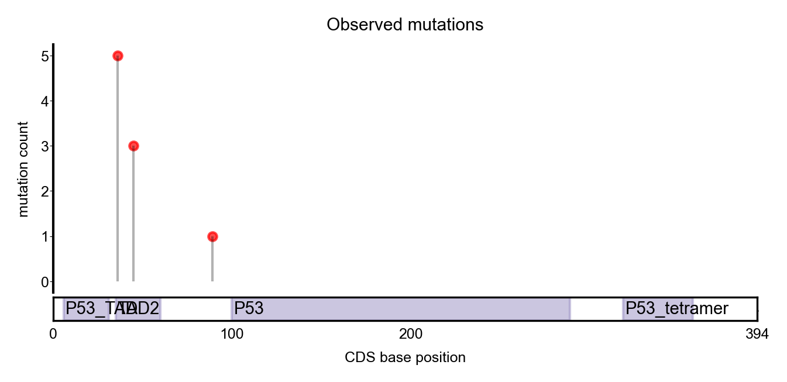

# Needle plot

## Description
A **needle plot** displays vertical lines that connect the data points to a horizontal baseline. 
Needle plots are useful when you want to plot frequency of mutations on the protein body.

The `needle_plot` function allows you to perform the needle plot with the representation of the protein body including domains.
It requires an **input matrix**  including gene name column called `'gene'`, nucleotide position column called `'Protein_position'` and the number of mutations affecting the same position `'number_observed_muts'`. 
The function also needs the **gene** name and the **transcript** used. 

## Function
```py
def needle_plot(data, gene, transcript):
    
    mpl.rcParams.update(mpl.rcParamsDefault)
    plt.rcParams['font.sans-serif'] = ['arial']
    plt.rcParams['font.size'] = 6
    plt.rcParams['font.family'] = ['sans-serif']
    plt.rcParams['svg.fonttype'] = 'none'
    plt.rcParams['mathtext.fontset'] = 'custom'
    plt.rcParams['mathtext.cal'] = 'arial'
    plt.rcParams['mathtext.rm'] = 'arial'
    mpl.rcParams['figure.dpi']= 200

    # get PFAM domains and subset the mutation data
    subset_data_pfam = get_PFAMs_per_transcript(df_pfam, df_names, transcript)

    # define figure layout
    fig = plt.figure(figsize=(8, 2.25))
    # ! SDM change
    gs = gridspec.GridSpec(11, 3, figure=fig)
    ax1 = plt.subplot(gs[1:-1, :2])
    ax2 = plt.subplot(gs[-1, :2], sharex=ax1)

    # plot for each axes
    plot_gene_full_nucleotide(subset_data_pfam, data, gene, transcript, ax1, ax2)
    ax2.set_xlabel('CDS base position')
    plt.show()
```

## Example
```py
data = pd.DataFrame({
    'gene': ['TP53', 'TP53', 'TP53'],
    'Protein_position': [45, 36, 89],
    'number_observed_muts': [3, 5, 1]
})

needle_plot(data, 'TP53', 'ENST00000269305')
```



## Dependencies
```py
import pandas as pd
import numpy as np
import matplotlib.pyplot as plt
import matplotlib.patches as patches
from matplotlib import collections as mc
from matplotlib import gridspec
from collections import defaultdict
from scipy.stats import norm
import matplotlib as mpl
import os

### PFAM info

BOOSTDM_DATASETS = "/workspace/projects/intogen_plus/intogen-plus-v2024/datasets/boostdm/"
PFAM_file_path = os.path.join(BOOSTDM_DATASETS, 'pfam_biomart.tsv.gz')
PFAM_info_path = os.path.join(BOOSTDM_DATASETS, 'pfam_info.name.tsv')
df_pfam = pd.read_csv(PFAM_file_path, sep="\t", names=["ENSEMBL_GENE", "TRANSCRIPT_ID", "START", "END", "DOMAIN"])
df_names = pd.read_csv(PFAM_info_path, sep="\t", names=["DOMAIN", "CLAN", "CLAN_NAME", "DOMAIN_NAME", "Long Name"])

## Functions

def get_PFAMs_per_transcript(df_pfam, df_names, transcript):
    # Get domains
    df_pfam_gene = df_pfam[(df_pfam["TRANSCRIPT_ID"] == transcript)]
    df_pfam_gene = df_pfam_gene[["TRANSCRIPT_ID", "START", "END", "DOMAIN"]].drop_duplicates()
    df_pfam_gene = pd.merge(df_pfam_gene, df_names[["DOMAIN", "DOMAIN_NAME"]].drop_duplicates(), how="left")
    df_pfam_gene["POS"] = df_pfam_gene.apply(lambda row: row["START"] + ((row["END"] - row["START"]) // 2), axis=1)
    df_pfam_gene["SIZE"] = df_pfam_gene.apply(lambda row: row["END"] - row["START"] + 1, axis=1)
    df_pfam_gene["Color"] = "#998ec3"

    return df_pfam_gene


def plot_gene_full_nucleotide(subset_data_pfam, df, gene, transcript, ax1, ax2):

    # plot for each axes
    df = data[data['Protein_position'] != '-']
    df = df[df['gene'] == gene]

    # remove those mutations not falling in CDS:
    ax1.set_title('Observed mutations')
    ax1.set_ylabel("mutation count")

    ax1.spines['bottom'].set_visible(False)
    ax1.spines['left'].set_linewidth(1)
    ax1.spines['right'].set_visible(False)
    ax1.spines['top'].set_visible(False)
    ax1.tick_params(axis='y', labelsize=6, pad=0.25, width=0.25, length=1.5)
    ax2.tick_params(axis='x', length=0)
    ax2.set_yticks([])

    # get the max_aa
    path_coord =  "/workspace/datasets/intogen/output/runs/v2020/20200703_oriolRun/CH_IMPACT_out/intogen_merge_20220325/cds_biomart.tsv"
    path_coord_gene = pd.read_csv(path_coord, sep='\t', low_memory=False,
                         names=['gene', 'gene_symbol', 'prot', 'chr', 's', 'e', 'aa', 'cds', 'genpos',
                                'strand', 'transcript'])
    path_coord_gene = path_coord_gene[path_coord_gene['transcript'] == transcript].sort_values(by='aa').reset_index(drop=True)
    max_aa = int(path_coord_gene.loc[0,'genpos']/3)
    ax1.set_xlim(0, max_aa)

    # plot observed mutations
    pos_list = df["Protein_position"].tolist()
    ys = df["number_observed_muts"].values

    coordinates_mutations = []
    x_axis = []
    y_axis = []

    # for each of the positions
    for i, p in enumerate(pos_list):
        if ys[i] > 0:
            coordinates_mutations.append([(int(p), 0),
                                      (int(p), ys[i])])

            x_axis.append(int(p))
            y_axis.append(ys[i])

    lc = mc.LineCollection(coordinates_mutations, colors='black', linewidths=1, alpha=0.3)
    ax1.add_collection(lc)

    size = 12
    ax1.scatter(x_axis, y_axis, s=size, c='red', alpha=0.7)
    
    ax2.set_ylim(0, 1)

                      
    for i, r in subset_data_pfam.iterrows():
        start_base = r['START']
        size_base = r['SIZE']
        rect = patches.Rectangle(xy=(start_base, 0), width=size_base, height=5, color=r["Color"], alpha=0.5, zorder=2)
        ax2.annotate(text=r["DOMAIN_NAME"], xy=(start_base + 1, 0.3), fontsize=7)
        ax2.add_patch(rect)
        ax2.set_xticks(np.append(np.arange(0, max_aa, 100)[:-1], max_aa))
        ax2.set_xticklabels(np.append(np.arange(0, max_aa, 100)[:-1], max_aa), fontsize = 6)
        ax2.set_xlim(0, max_aa)
        ax2.set_yticks([])
        ax2.tick_params(axis='x', which='major', pad=3)
            
    ax1.tick_params(axis='x', labelsize=0, color='w')

    ax2.set_xlabel('CDS base position')

    plt.show()
```

## Reference
Joan Enric
