# GitHub Copilot

## Features

Here's the official video from VSCode explaining the basic features of GitHub Copilot:

 <!-- markdownlint-disable MD033 -->
  <iframe width="560" height="315" src="https://www.youtube.com/embed/jXp5D5ZnxGM?si=WjWpCqX5EHy1BNPU" title="YouTube video player" frameborder="0" allow="accelerometer; autoplay; clipboard-write; encrypted-media; gyroscope; picture-in-picture; web-share" referrerpolicy="strict-origin-when-cross-origin" allowfullscreen></iframe><!-- markdownlint-disable MD013 -->

### Ghost Text

- Code as you normally would, and the ghost text will start to appear.
- You can also trigger the ghost text by writting a comment about what you want to do.
- Hit `Tab` to accept the ghost text or `Ctrl + Right Arrow` to accept one word at a time.
- Hit `Esc` to dismiss the ghost text.

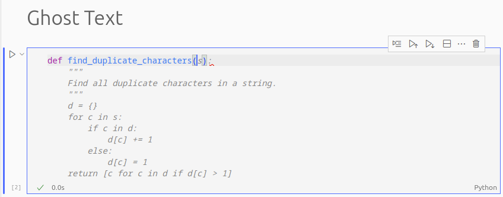

### Code Suggestions

- If you want to see more suggestions, you can hit `Ctrl + Enter` for Copilot to generate several suggestions in a
- separate window for you to accept whichever one you want to use.

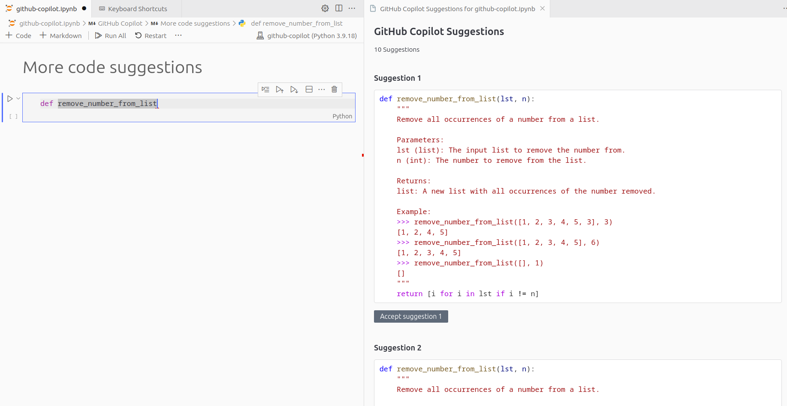

!!! TIP
    If you are using a Jupyter Notebook, the `Ctrl + Enter` command will run the cell, so if you want to open the
    suggestions panel, you can change the keybinding in the settings.
    Go to `File > Preferences > Keyboard Shortcuts`, search for `GitHub Copilot: Open Completions Panel` and change
    the keybinding to whatever you want (for example, `Ctrl + K`, `Ctrl + Enter`).

### Inline Chat

- Triggered by `Ctrl + I`.
- The generated code doesn't exist in your file until you hit accept.
- Highlight the part of the code you want to discuss or change, and then hit `Ctrl + I` to ask
Copilot for what you want to do.

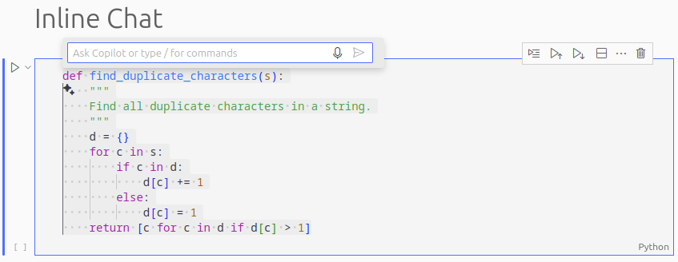

### Chat Sidebar

- Classic chat interface.
- In the side bar, search for the chat icon.

- You can ask for help, ask for explanations, or ask for more suggestions.
- When you get code suggested, you also get a small panel to quickly insert the code into
your file, copy the content, and more options.

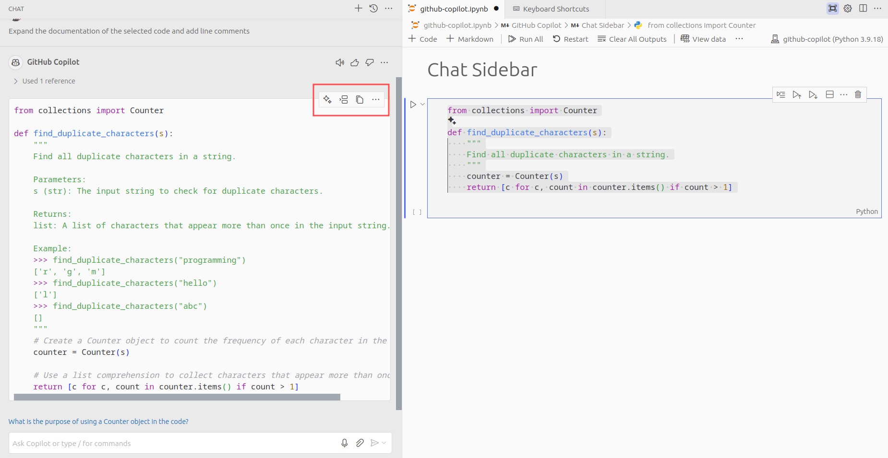

### Code Refactoring

Copilot is very useful even if you are not actively interacting with it. Just by typing and accepting
the ghost suggestions, you will see your coding performance improving. Having said that, there are more
ways you can use Copilot to refactor your code.

#### Improve Code

You can ask Copilot to improve your code, for example, by making it more efficient, more readable,
or by adding documentation and comments to it.

- **Efficiency**: Copilot can suggest ways to make your code more efficient, for example,
by using a more efficient algorithm or by reducing the number of lines of code.
- **Readability**: Copilot can suggest ways to make your code more readable, for example, by using more descriptive
variable names or by breaking down complex code into smaller, more manageable pieces.
- **Documentation**: Copilot can suggest ways to add documentation and comments to your code, for example, by adding
comments to explain what a particular piece of code does or by adding documentation to explain
how a particular function works.

#### Rename Variables

By typing `F2` when having your cursor on top of a variable or function name, you can rename
it accross the entire file. This is integrated in VSCode by default, but with
Github Copilot, you get access to suggestions for the new names.

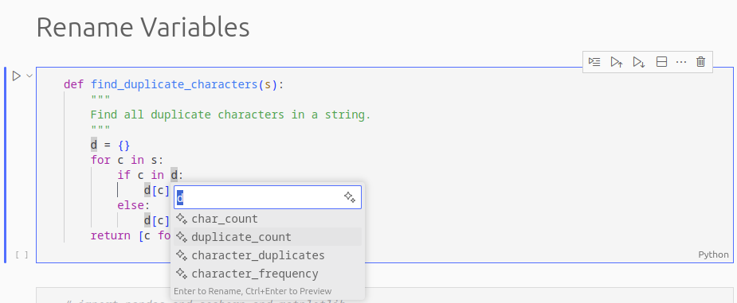

### Git Integration

#### Commits

If you go to the source control tab in VSCode, you will see a sparkle ✨ icon that when clicked will understand the
changes you made and suggest a commit message for you.

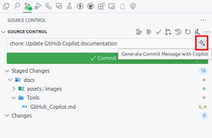

#### Pull Requests

Github Copilot can also help you create a pull request. After clicking the icon to create a pull request next to your
branch, you will see the prompt to add a title and the pull request body. Next to the title box, you will see the same
sparkle ✨ icon that will suggest both the title and the body of the pull request.

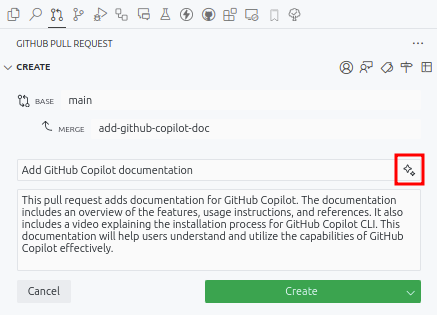

### Useful Commands

#### `/fix`

Fix the selected code. You can also give the error message you are getting. This command is more powerful than not
using it, even though sometimes there might be no difference.

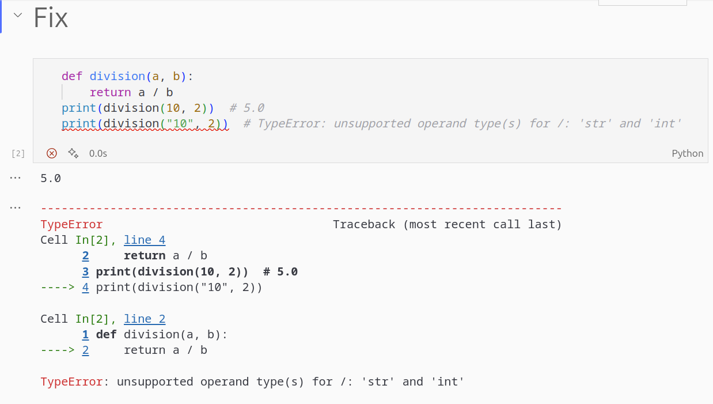
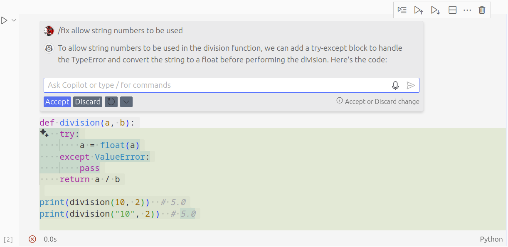

#### `/explain`

Explain the selected code.

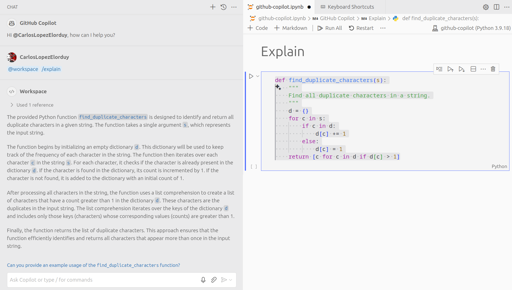

#### `/tests`

The command `/tests` will generate a test for the selected code. This makes writting tests much easier and faster.

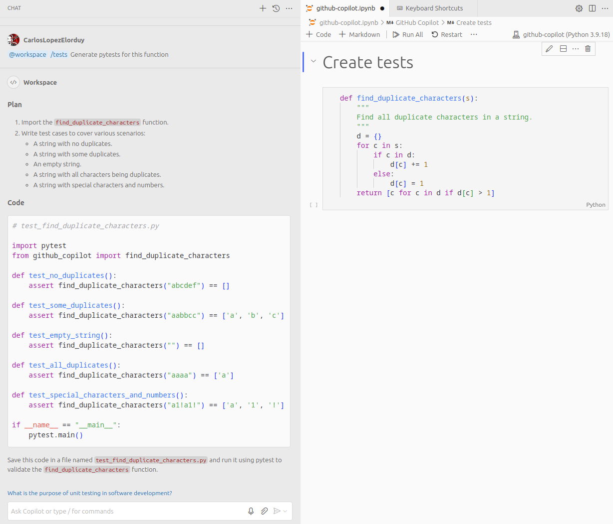

#### `/new`

Create any file or even workspace based on your instructions. This also includes the content of the file.

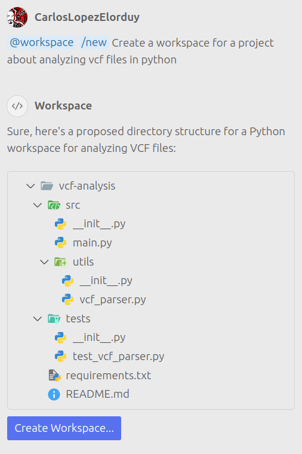

#### `/newNotebook`

Create a Jupyter Notebook based on the instructions you provide. It works better than the `/new` since this one is
specifically designed for Jupyter Notebooks, which turns more powerful for this usecase.

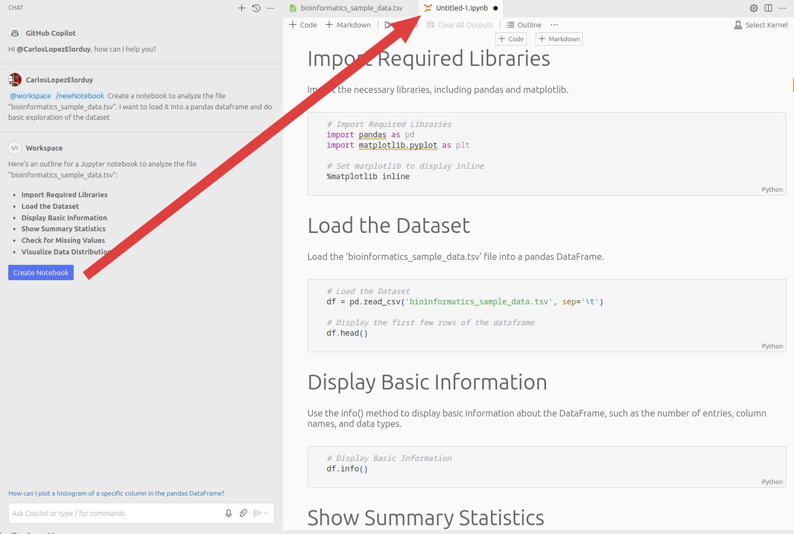

#### `@terminal`

Ask how to do something in the terminal.

### Manage Context

Normally, if you want to provide context for your query, you simply need to **highlight** the code you want to use as
context. However, you can also use the following commands to provide context:

#### `@workspace`

By adding this command next to your query, you are telling Copilot to look at the entire workspace to give you a better
suggestion. The workspace corresponds to the root folder that you have opened in VSCode.

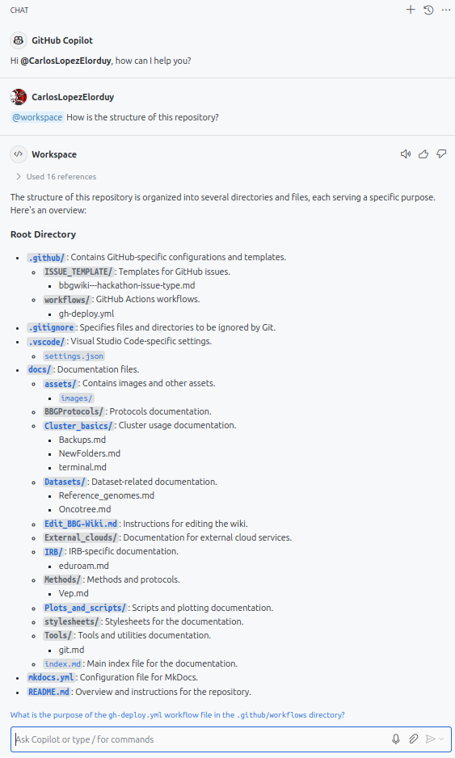

!!! TIP
    Try to open VSCode in the root folder of your project, instead of a very general folder (such as `/workspace`,
    `/workspace/projects`, etc), to get more accurate suggestions, since Copilot won't have to
    look through a lot of files to give you a suggestion.

#### `#file`

If you want to use one or more specific files as context for your query, you can add the `#file` command followed by
the name of the file you want to use. This can be done as many times as you want, with different files.

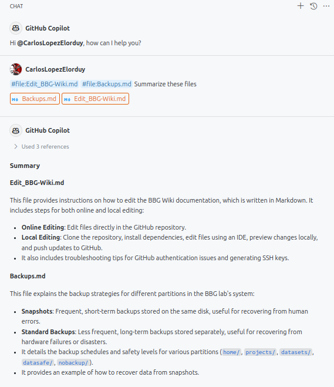

!!! WARNING
    If the file you are using as context is too big, Copilot will highlight that file indicating
    that it couldn't use the whole content of the file, but still attempt to give you a suggestion
    based on the part of the file it could read.

#### `#terminalSelection`

Similarly to the way that you can just select part of your code to use it as context for Copilot, you can highlight
anything in the terminal and use the `#terminalSelection` command to tell Copilot to use that as context.

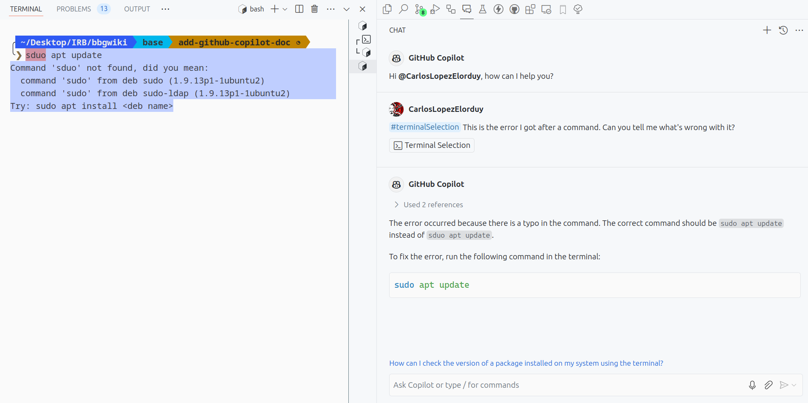

#### `#terminalLastCommand`

If you want to use the last command you executed in the terminal as context for your query,
you can use the `#terminalLastCommand` command.

!!! TIP
    The difference between this one and the ' #terminalSelection' is that this one will use the last
    command you executed in the terminal, whithout having to highlight anything, while the other one will use whatever
    you have selected in the terminal, even if it has nothing to do with the latest command you executed.

### Installation & Setup

#### Local Machine

If you want to install GitHub Copilot in your local machine, you can simply install it from the Extensions tab in
VSCode. Once you hit install, it will ask you to sign in with your GitHub account.

!!! NOTE
    You need to have done the setup asked by IT in order to enrol into the GitHub Academy program. The instructions
    on how to do so are [here](https://irbwiki.irbbarcelona.pcb.ub.es/books/howtos/page/enrol-github-academy).

#### Cluster

As seen in [VSCode in interactive node](VSCode/cluster_node.md), you can also use GitHub Copilot in the cluster.

===+ "VSCode App Setup"

    Same as with the VSCode App (see section [*Local Machine*](#local-machine)). Just go to the Extensions tab in <!-- markdownlint-disable MD046 -->
    VSCode and install GitHub Copilot.

=== "Browser (*code-server*)"

    1. Visit the [GitHub Copilot Extension page](https://marketplace.visualstudio.com/items?itemName=github.copilot){:target="_blank"}.
    2. Look for a "Download Extension" link. It shoudl be in the side-bar under the "Resources" header.
    3. You'll get a file called something like `GitHub.copilot-1.226.0.vsix`. Move this file into the cluster.
    4. With your VSCode session opened from the cluster, go to the Extensions tab and click on the three dots in the top right corner. Select "Install from VSIX..." and select the file you just moved into the cluster.
    5. You will be asked to sign in with your GitHub account. Follow the instructions to do so.
    6. You should now have GitHub Copilot installed in your cluster session.
    
    !!! NOTE
        As of the time of writing, this way of installing GitHub Copilot only includes the feature of the [Ghost Text](#ghost-text), but not the rest of the features.

## GitHub Copilot CLI

You can use GitHub Copilot in the terminal as well!

Here's a video with the installation process and an explanation of how to use GitHub Copilot CLI in the terminal:

  <iframe width="560" height="315" src="https://www.youtube.com/embed/fHwtrOcLAnI?si=7ztVv97_zvfsFCde" title="YouTube video player" frameborder="0" allow="accelerometer; autoplay; clipboard-write; encrypted-media; gyroscope; picture-in-picture; web-share" referrerpolicy="strict-origin-when-cross-origin" allowfullscreen></iframe> <!-- markdownlint-disable MD013 -->

There is an option to use GitHub Copilot in the terminal. There, you will have mainly two commands:

- `gh copilot suggest` or `ghcs`: **GitHub Copilot Suggest**. It will return a command based on your instructions.
  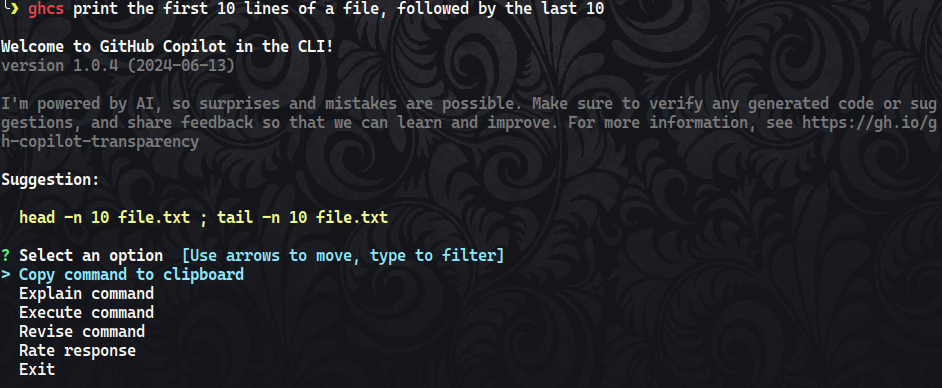

- `gh copilot explain` or `ghce`: **GitHub Copilot Explain**. It will return an explanation of the command that was
suggested. You can ask for an explanation of the command by using the command `ghce` or by selecging the option
`Explain command` when you run the `ghcs` command.
  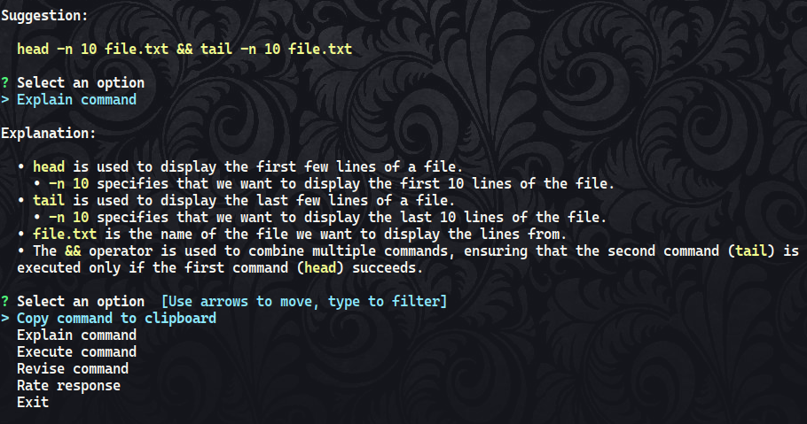

If you see that the suggestion needs to be changed or you want to add extra information, you can select the
option `Revide command` when you run the `ghcs` command.

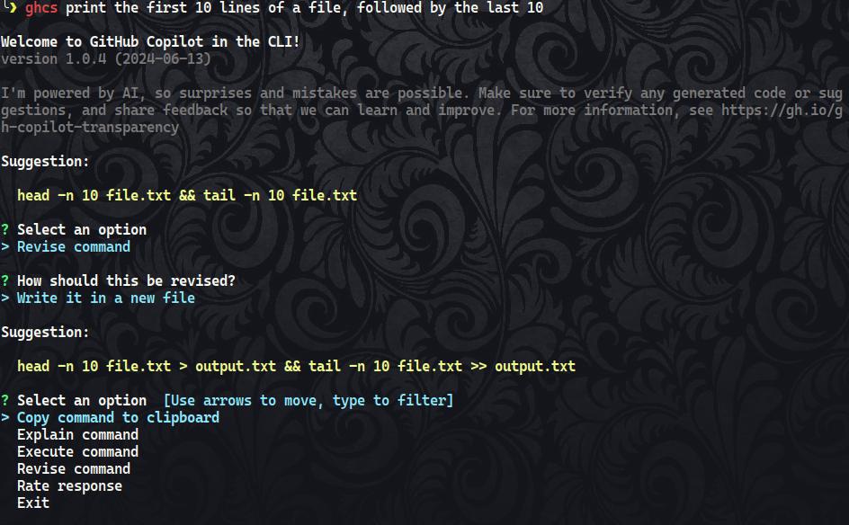

### Installation

The instructions on how to set it up can be found [here](https://github.blog/changelog/2024-03-21-github-copilot-general-availability-in-the-cli/){:target="_blank"}.<!-- markdownlint-disable MD013 -->

## References

- Carlos López-Elorduy
- Federica Brando
- Izar de Villasante
