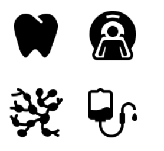
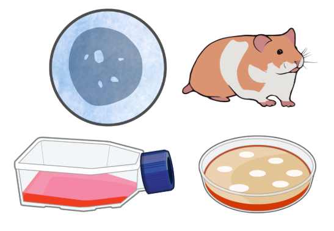

# Repositories of SVG icons

In this page you can find a list of resources to download free SVGs and PNGs. SVGs are very useful as they are
vector-based images, so they can be scaled without losing quality and are highly customisable with tools like Inkscape.

When using graphical icons in our slides, posters, reports and other materials we should take into account that in
some cases there are usage rules (attribution is sometimes required, some icons cannot be modified...). To avoid
these problems, I have gathered several pages that are "_open-access_", and the usage of these icons is less
restrictive. However, I recommend to always check the rules in case any policy is updated.

- [**Iconpacks**](https://www.iconpacks.net): a repository of SVG and PNG icons from a wide range of topics,
- not only biomedicine related. These icons are free and can be used for both commercial and personal projects.
- You can also modify the icons as you wish (they even offer a customisation tool). No attribution is required,
- but they state that credit will be appreciated.

{ width="300" height="200" style="display: block; margin: 0 auto" } <!--markdownlint-disable MD013-->

- [**Healthicons**](https://healthicons.org): a repository of SVG and PNG icons biomedicine related.
These icons are free and can be used for both commercial and personal projects. You are also free to modify the icons
as you wish. No attributions is required. A cool feature is that you can send requests of icons that are not there.

{ width="300" height="200" style="display: block; margin: 0 auto" }<!--markdownlint-disable MD013-->

- [**NIH Bioart**](https://bioart.niaid.nih.gov): a repository of SVG and PNG icons biomed-related. This is an
- initiative from the NIH. Most icons are of public domain so citation is appreciated but not required; however,
- there are other icons subject to other licenses, so I recommend looking to the citation guides.

{ width="300" height="200" style="display: block; margin: 0 auto" }<!--markdownlint-disable MD013-->

## References

- Olivia Dove-Estrella
