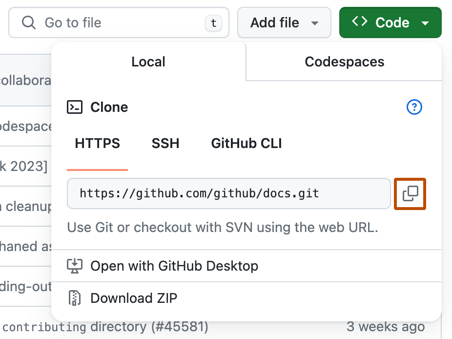
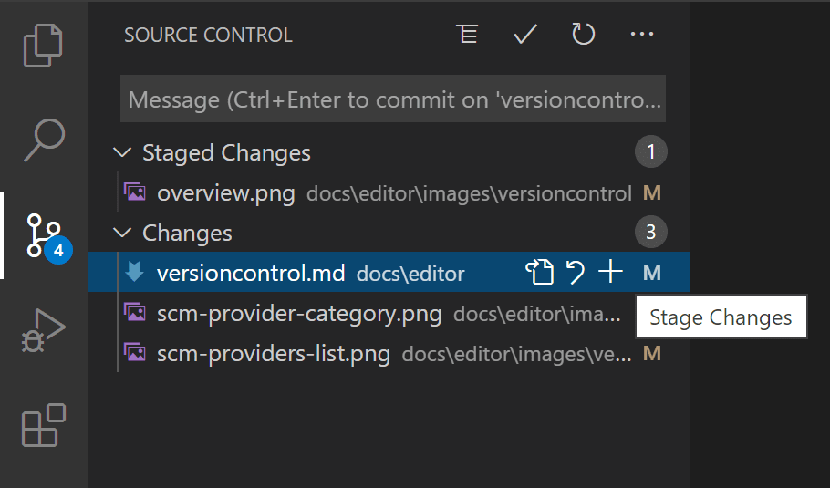
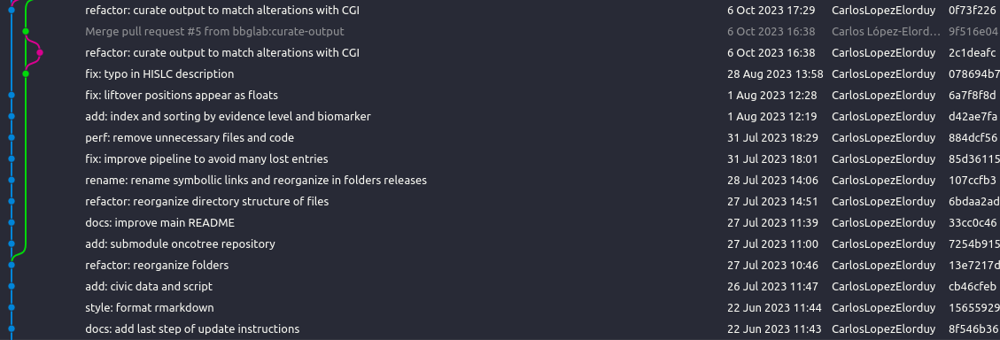
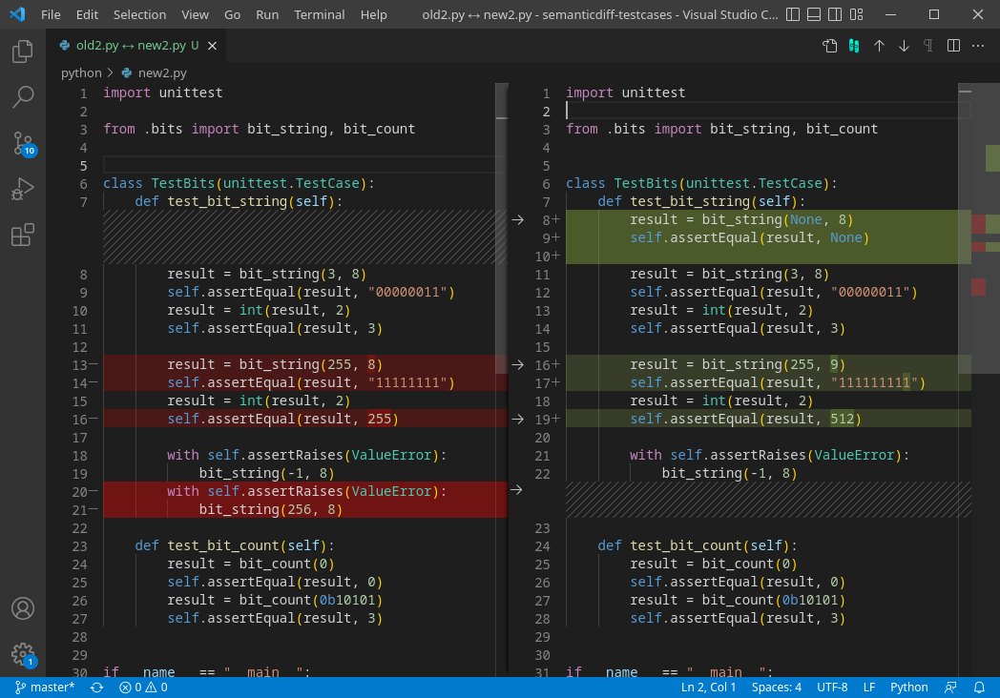

# Git

This section contains information about how you can use Git to manage your projects in terms of version control and collaboration.

**Advantages**:

- 📝 Keep track of **changes** in your project and scripts.
- 👥 **Collaborate** with other people.
- 🌐 **Share** your project with other people.
- ⏪ Go back to a **previous version** of your project.

## Key concepts

- **Repository**: A repository is a collection of files and folders that you want to track with Git. A repository can be local (on your computer) or remote (on a server such as GitHub).
- **Commit**: A commit is a **snapshot of your project at a given time**. It contains all the files and folders that are part of your project at that time. When you want to change something in your project, you need to create a commit. This commit will contain the **changes you made** to your project.
- **Branch**: A branch is a **parallel version of your project**. It allows you to work on different versions of your project at the same time. For example, you can have a branch for the development of a new feature and another branch for fixing bugs.
- **Merge**: A merge is the **combination of two branches**. When you merge two branches, the changes made in one branch are added to the other branch.
- **Pull request**: A pull request is a **request to merge two branches**. It is usually used to merge a branch into the main branch of your project.
- **Workspace**: A workspace is your **working area** where you can make changes to your project. It is usually a folder on your computer.
- **Staging**: The staging area is a **temporary storage** where you can add files before creating a commit. This allows you to create commits with only the files you want to include.

## Initialize Git in your project

To initialize Git in your project, you need to run the following command in the root directory of your project:

```bash
cd <project-directory>
git init
```

This will create a `.git` directory in your project. This directory contains all the information about your project and its history.

### Git commands

In this page, we will explain the most common Git commands. For more information, you can check the [Git documentation](https://git-scm.com/doc) or the [Git cheetsheet](https://quickref.me/git).

#### Basic

- `git status`: Check the status of your project (files changed, files added, files removed, etc.).
- `git add <file>`: Add a file to the staging area. This means that the file will be included in the next commit.
- `git commit -m "<message>"`: Create a commit with the files in the staging area and add a message to the commit.
- `git push`: Push/Upload your commits to a remote repository.
- `git pull`: Pull/Apply the changes from a remote repository to your local repository.

#### Advanced

- `git clone <url>`: Clone a remote repository to your local computer.
- `git log`: Show the history of your project.
- `git reset <file>`: Remove a file from the staging area.
- `git reset <commit>`: Remove a commit from the history of your project.
- `git checkout -b <branch>`: Create a new branch and switch to it.
- `git checkout <branch>`: Switch to another branch.
- `git merge <branch>`: Merge a branch into the current branch.
- `git branch -d <branch>`: Delete a branch.
- `git diff`: Show the changes made to your project.
- `git stash`: Save your changes in a temporary storage.
- `git stash pop`: Apply the changes from the temporary storage to your project.
- `git fetch`: Download the changes from a remote repository to your local repository.


## GitHub

GitHub is a platform that allows you to host your Git repositories in the cloud. It also provides a web interface to visualize the history of your project and collaborate with other people.

The BBGLab github is: [https://github.com/bbglab](https://github.com/bbglab). Here you can find all the repositories of the BBGLab, as well as create new ones for your projects.

### Clone a repository

To clone a repository from GitHub, follow the next steps:

1. Go to the repository page on GitHub.
2. Click on the green button "Code" and copy the URL.

3. Open a terminal and run the following command:

```bash
git clone <url>
```

## Visual Studio Code

The [Visual Studio Code](https://code.visualstudio.com/) editor has a built-in Git integration that allows you to manage your Git repositories from the editor. It offers a graphical interface to visualize the history of your project, create commits, switch branches, etc.

### Features

- **Source Control**: Manage your Git repositories from the editor.

- **Git Graph**: Visualize the history of all the changes in your project.

- **Diff Editor**: Visualize the changes made to your project.


## Best practices

### Commits

- **Commit Related Changes**
  A commit should be a wrapper for related changes. One commit = one task.

- **Commit Often**
  Small commits are easier to review, rollback, and share.

- **Don't Commit Half-Done Work**
  You should only commit code when a logical component is completed.
  If you're tempted to commit just because you need a clean working copy (to check out a branch, pull in changes, etc.) consider using `git stash` instead.

- **Test Your Code Before You Commit**
  Test it thoroughly to make sure it really is completed and has no side effects (as far as one can tell).

- **Write Good Commit Messages**

  | **Type**   | **Description**                                        |
  |------------|--------------------------------------------------------|
  | `add`      | new code                                               |
  | `fix`      | bug fix                                                |
  | `chore`    | maintenance, tooling, or other non-production changes  |
  | `feat`     | new feature for the user                               |
  | `test`     | adding or updating tests                               |
  | `refactor` | code restructuring (variable names, functions, folders)|
  | `docs`     | documentation only                                     |

  Each commit message should start with one of the types above, followed by a colon and a short description. For example:

  ```text
  feat: add functionality
  fix: resolve crash
  docs: update usage guide
  ```

### Branching

- **Clear Naming Convention**  
  Use `type/short-description` (e.g. `feature/this-is-a-new-feature`, `bugfix/in-this-we-fix-an-error`, `chore/update-dependencies`).

- **One Concern per Branch**  
  Keep each branch focused on a single feature, bugfix, or chore to make review and testing easier.

- **Regularly Sync with Main**  
  Pull or rebase the latest `main` into your branch often to minimize merge conflicts.

- **Short-lived Branches**  
  Aim to finish and merge branches within a few days; long-lived branches increase integration pain.

- **Use Pull Requests for Merging**  
  Open a PR against `main` (or your integration branch), add a clear description (you can use GitHub copilot to automatically generate a clear description of your PR), link related issues.
  Add at least one reviewer and wait for the approval before merging to `main`.

- **Clean up after merge**  
  Delete branches once they’ve been merged to keep your repo tidy and avoid confusion.

## References

- Carlos López-Elorduy
- Federica Brando
- Davide Scarpetta
