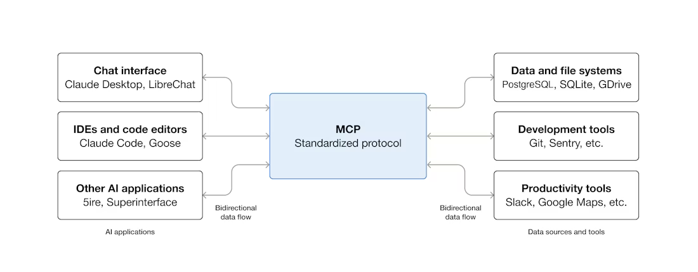

# Model Context Protocols (MCPs) with GitHub Copilot

## Introduction to MCPs

### What is Model Context Protocol?

Model Context Protocol (MCP) is an open-source standard that enables AI applications like GitHub Copilot to connect to external systems and data sources. Think of it as a universal adapter that allows your AI coding assistant to access and interact with various tools, databases, file systems, and services directly from within your development environment.



### Benefits of using MCPs

- MCPs allow the creation of agents that can perfomr tasks autonomously.
- MCP servers are easy to develop and can be used to control the flow of the data.
- As the data is retrieved from the MCP server, there are less hallucinations.

### Built-in tools in VSCode

- **Terminal**: Enables executing commands in the terminal.
- **File Explorer**: Enables to find and read/write files.
- **Tests**: Enables to run tests and check results.
- **Git**: Enables to detect git changes in the workspace.

## Installation and Setup in VSCode

### Prerequisites

Before setting up MCP with GitHub Copilot, ensure you have:

- **VSCode** (version 1.85 or later)
- **GitHub Copilot extension** installed and active subscription. Check [GitHub Copilot](https://bbglab.github.io/bbgwiki/VSCode/GitHub_Copilot)

### Finding MCP Servers

1. Browse the [MCP servers registry](https://github.com/modelcontextprotocol/servers)


### Installation

If there is not a button to install the MCPs in VSCode, the best way add the JSON snippet to the list of MCPs which is in:

```bash
# Linux/Mac
~/.config/Code/User/mcp.json
```

This file is not there by default, you have to create it to configure the MCP servers.

```bash
cat > ~/.config/Code/User/mcp.json << 'EOF'
{
  "mcpServers": {
  }
}
```

Then, you can add the snippet to the file.

```json
# Add example
```
