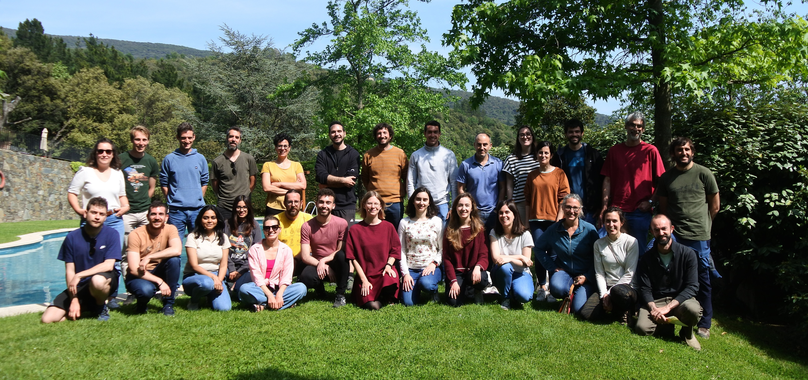

<!-- # Home -->
# Welcome to the BBG-Wiki! 

This website is meant to include information of all the **tools** and **data** used by the **bbglab** team, so that it serves both as a guide to understand them and as a place where to find information about everything.

 

---

 

