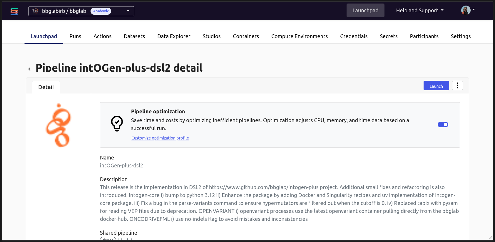
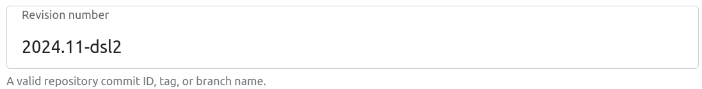
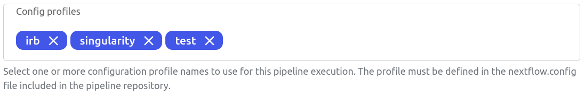
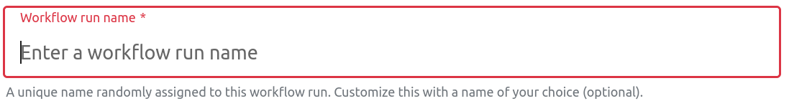
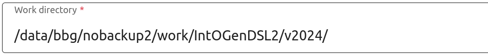

# IntOGen Plus

<!-- 
TODO: Brief introduction on what is intogen - its website and its purpose, use webs and repo as reference.
-->
[](https://github.com/bbglab/intogen-plus-dsl2/)<!-- markdownlint-disable MD013 -->

It's a framework for automatic and comprehensive knowledge extraction based on mutational data from
sequenced tumor samples from patients.

## Run IntOGen DSL2

Great effort was put to migrate IntOGen from nextflow DSL1 to nextflow DSL2. This effort allowed to be able to run the
pipeline within our seqera platform dashboard.

From the bbglabirb/ALP_pipelines workspace [launchpad](https://cloud.seqera.io/orgs/bbglabirb/workspaces/ALP_pipelines/launchpad),
you can access the pipelines available in our workspace.

!!! question "I can't see the workspace, what should I do?"
    Please refer to Miguel or to Federica to solve this issue

By clicking on [intOGen-plus-dsl2](https://cloud.seqera.io/orgs/bbglabirb/workspaces/ALP_pipelines/launchpad/217132460501467?sourceWorkspaceId=97012242959019)
you'll be able to launch the pipeline.



Before launching the pipeline, some parameters need to be configured. Here a simple but complete list of
useful parameters is explained.

!!! warning "We highly recommend to keep the defaults for those parameters not discussed in this page."

=== "General config section"

    #### **Revision number**<!-- markdownlint-disable MD046 -->
    
    { height="300" style="display: block; margin: 0 auto" }

    By default, the **revision number** is linked to the stable tag of the pipeline. As of now - it's `2024.11-dsl2`. 
    This can eventually be changed if a run is resumed or relaunched from the run section.

    !!! note "Please be aware that changing this section may affect the `resume` option"

    #### **Config profile**

    { height="300" style="display: block; margin: 0 auto" }

    - `test` --> this is using the [CBIOP cohort](https://github.com/bbglab/intogen-plus-dsl2/blob/dev/DSL2/tests/data/pipeline/input/cbioportal_prad_broad/data_mutations_extended.txt) in the repo [optional]<!-- markdownlint-disable MD013 -->
    - `test_full` --> this is using the full datasets of intogen [optional].
    - `singularity` --> this is allowing the use of singularity for using the containers
    - `irb` --> this is allocating the right resources and queue for the slurm executor in the IRBCluster

    #### **Workflow run name**

    { height="300" style="display: block; margin: 0 auto" }

    It's **mandatory** to write a meaningful name. Here follows some examples:

    - If I am running a new combination optimization I would call the run: `optimization_combination`
    - If I am running a FULL run with a new final version of intogen I would call it: `v3.0_ALL`
    - If I am reproducing the v2024 run I would call it: `v2024_ALL`
    - If I am running a specific cohort from an external collaborator I would call it: `v2024_EXT_COLLAB`

    #### **Work directory**

    { height="300" style="display: block; margin: 0 auto" }
    
    By default, the work directory is `/data/bbg/nobackup2/work/IntOGenDSL2/v2024/`.
    For faster execution you can use the scratch partition in the cluster: `/scratch/bbg/work/IntOGenDSL2/v2025/<your-subfolder>`.
    Replace `<your-subfolder>` with a meaningful name, such as the `Outdir` value from the next section, to avoid conflicts.
    
    !!! warning "Delete the work folder once the intogen run finishes successfully."
    

=== "Run parameters section"

    #### **Input**<!-- markdownlint-disable MD046 -->

    This parameter is read as a string, and it should be the absolute paths of the folder that openvariant will iterate
    separated by a space. Here it follows an example:

    ```sh
    /path/to/datasets/for/intogen/input1 /path/to/datasets/for/intogen/input2 /path/to/datasets/for/intogen/input3
    ```

    !!! question "How do I prepare the input for IntOGen?"
        Great question! Here the documentation where everything is explained: 
        [intogen-plus.readthedocs](https://intogen-plus.readthedocs.io/en/v2024/usage.html#input)

    #### **Outdir**

    This parameter is where the output of intogen will be stored. By default we store
    intermediate runs that might fail here:

    ```sh
    /data/bbg/nobackup2/scratch/intogen_dev_tests/dev-DSL2/v2024/<MeaningfulName>
    ```

    !!! note "It's important to add a meaningful name as a final directory output"
        by default IntOGen will create a folder with a date where all the results will be stored. This although
        requires an higher level of specificity in the top folder.

        e.g. If I am running an external collab for LUNG data, I will add as an `outdir` parameter:
        ```sh
        /data/bbg/nobackup2/scratch/intogen_dev_tests/dev-DSL2/v2024/Lung_external_collab
        ```
        
        The IntOGen pipeline will by default create a subdirectory with the date of the
        launch where it will store all the files:
        ```sh
        /data/bbg/nobackup2/scratch/intogen_dev_tests/dev-DSL2/v2024/Lung_external_collab/20250423/
        ```


    Stable runs and releases are officially stored in a safer partition: 
    ```sh
    /data/bbg/datasets/intogen/output/runs
    ```

Once both those sections are completed we are safe to run the pipeline.

### FAQs

!!! question "The pipeline failed. How do I resume?"
    In the [run tab](https://cloud.seqera.io/orgs/bbglabirb/workspaces/bbglab/watch) click on the three
    dots on the right of your run and click `Resume`.

- TBC

## References

- Federica Brando
- Miguel Grau
